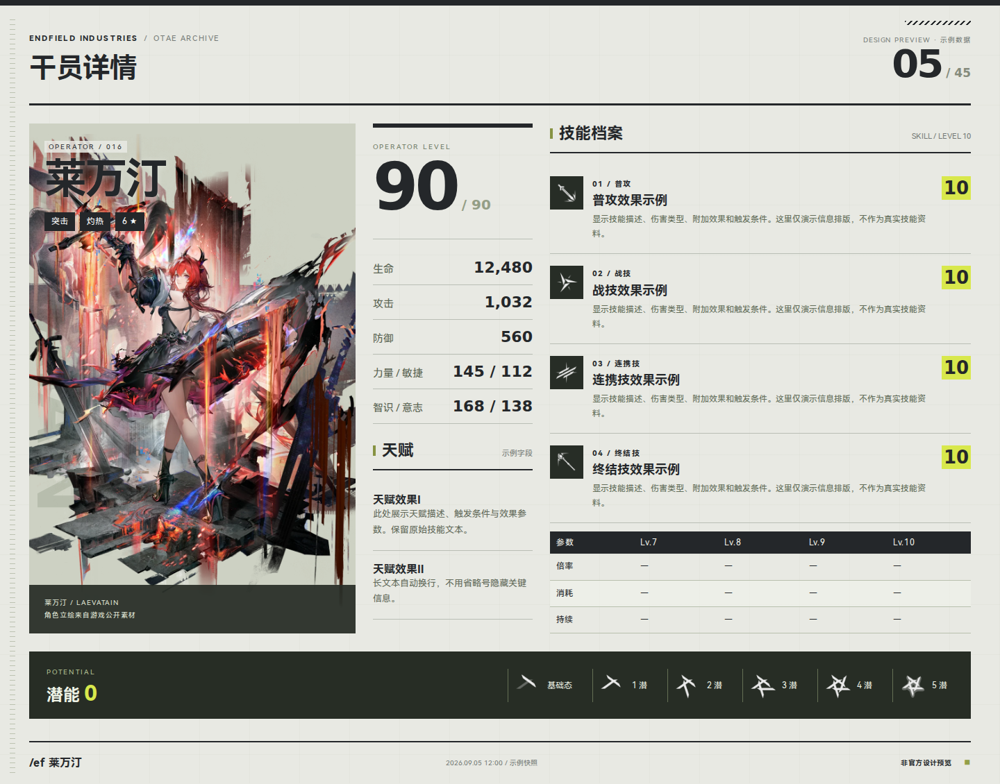
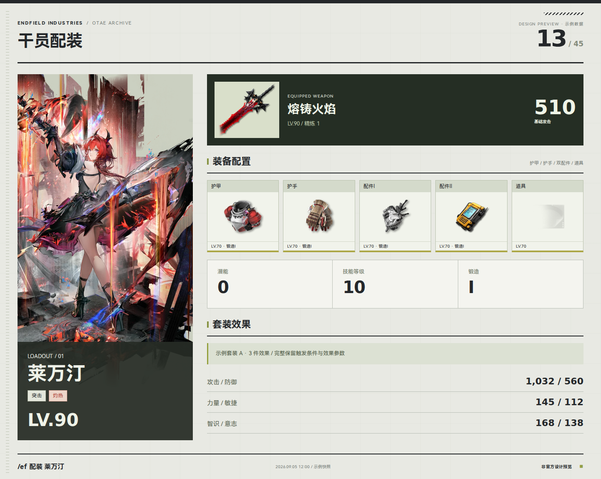
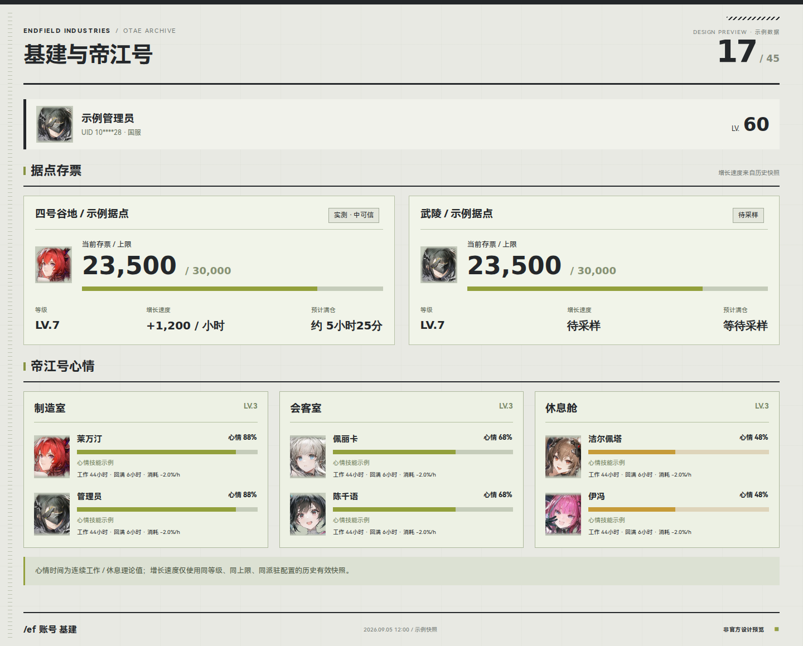
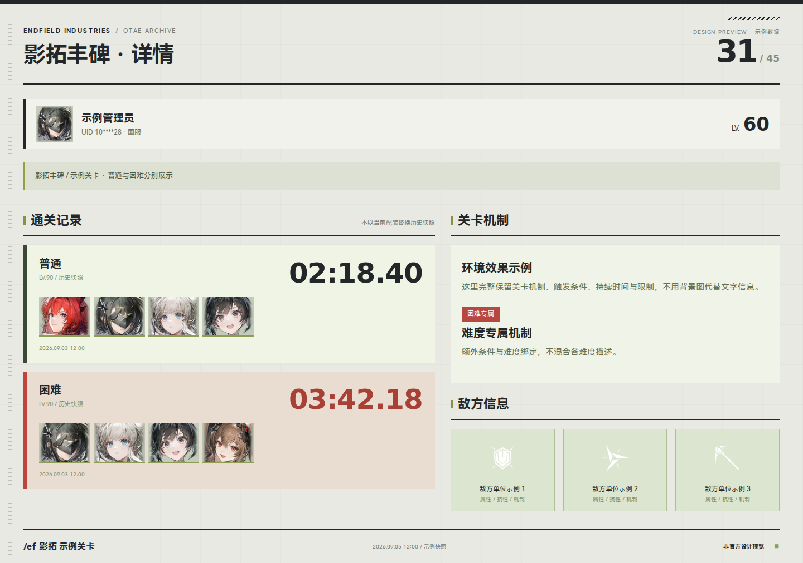
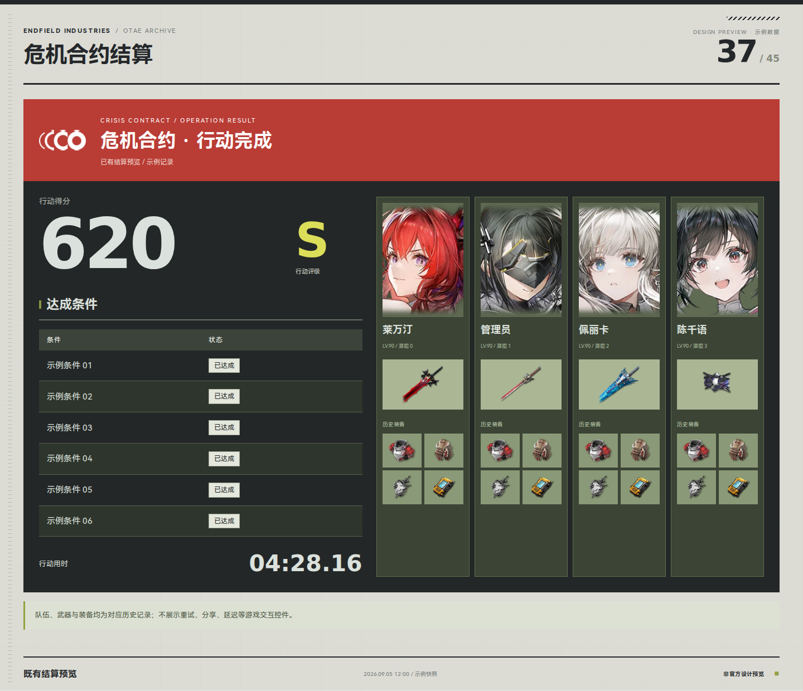
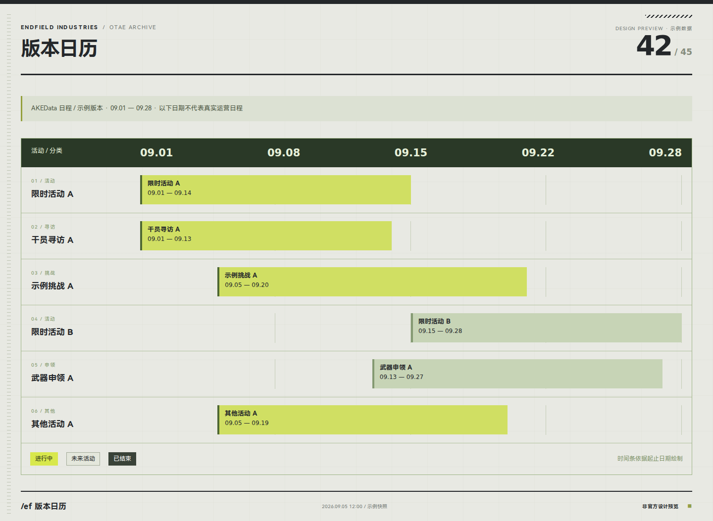

# End 插件 · 全页面代码预览

独立的 HTML/CSS/JavaScript 设计评审项目。**只做预览，不接入正式插件，不修改任何业务逻辑，不调用账号接口。**

45 个页面 / 状态可以按分类切换、搜索、通过 URL hash 单独打开，也可以一键批量导出真实浏览器截图。页面文字、表格、图表、时间轴、布局全部由代码生成；没有使用 AI 生图或将整张设计图当作前端背景。

## 运行

在仓库根目录执行（只需 Python 3.10+，无前端安装或构建步骤）：

```bash
python3 design/endfield-preview/tools/serve.py --port 8765
```

打开 <http://127.0.0.1:8765/>。服务器仅绑定本机，不会暴露整个仓库；只有预览目录和明确列出的字体、游戏素材目录可访问。

- `/#operator`：干员详情。
- `/#base`：基建与帝江号。
- `/?capture=1#war-detail`：隐藏评审控件，查看纯净画布。
- 左右方向键：切换页面；输入框中不拦截方向键。
- 侧边栏、翻页按钮和搜索属于评审工具，不是计划新增到机器人的功能。

## 真实代码截图

以下图片由本目录代码在 Chromium 中实际渲染。它们不是 AI 生成图；全部 45 页可通过导出命令重现。

### 干员详情



### 配装



### 基建与帝江号



### 影拓详情



### 危机合约结算



### 版本日历



## 页面覆盖

| 分组         | 页面 / 状态                                                                        |
| ------------ | ---------------------------------------------------------------------------------- |
| 入口与查询   | 帮助、搜索结果、账号管理、异常效果速算                                             |
| 图鉴与配装   | 干员详情与目录、武器详情与目录、装备目录、属性筛选、装备详情、单套装目录、干员配装 |
| 账号与基建   | 个人名片、账号详情首页与续页、基建与帝江号                                         |
| 签到与资源   | 多账号签到回执、养成总览、材料与排行、资源流水                                     |
| 抽卡档案     | 干员寻访、武器申领、历史记录、同步与导入回执                                       |
| 奖章与持有率 | 蚀刻章统计、缺章报告、群内 / 全局干员持有率                                        |
| 影拓丰碑     | 总览、详情、历史、暂无记录                                                         |
| 超域回响     | 总览、详情、历史、已有危机合约结算预览                                             |
| 公开关卡     | 副本目录、详情、变体对比、已有旧版挑战预览                                         |
| 日历与系统   | 数据源版 / 官方内容版日历、错误状态、维护回执                                      |

45 是评审画布数，不代表新增 45 个功能。首页 / 续页、范围、既有未公开预览和文本回执变体单独计数。源码入口覆盖依据：`draw.py`、`account_*_draw.py`、`account_challenge.py`、`stage_draw.py`、`ownership_stats_draw.py`、两类日历渲染器与现有帮助/命令处理；预览不导入这些模块，兼容未做代码结构重构的主分支。

## 设计与数据边界

- 参考终末地实机菜单的硬边信息区、细分隔线、雾白/炭黑底色、酸黄标记和大数字。不是常见圆角网站后台。
- 使用原生 HTML 文本、Grid/Flex、CSS 条形 / 堆叠 / 环形图和时间轴；1440px 固定卡片画布，评审外壳适配小窗口。
- 历史记录与当前配装分开；未通关不展示假的时间和队伍；无记录不转换为 0% 完成度。
- 基建保留存票、增长速度、预计满仓、实测/待采样、心情与工作/回满信息；持有率仅有干员，保留分服与潜能分布；免费十连与保底单独展示。
- 所有账号、日期、统计数值、效果描述和活动均为**示例数据**。装备/材料缩略图复用公开素材作占位，不代表真实名称或成本关联。不会重写公式、改变命令或发布新活动信息。
- 单页展示代表性条目；真正接入时仍需保留全部字段、条目、分页、数据源与异常处理规则，并用真实长文本重新验证。
- UI 预览提交仅包含 `design/endfield-preview/`。`refactor/project-architecture` 在此基础上另行提交程序架构重构；预览仍不接入正式插件。

## 测试与全量截图

```bash
# JavaScript 页面覆盖与信息边界测试（Node.js 18+）
node --test design/endfield-preview/tests/pages.test.js

# 静态服务器边界与路径穿越测试
python3 -m unittest discover -s design/endfield-preview/tests -p 'test_*.py'

# 可选：导出截图需要 Playwright 及 Chromium
python3 -m pip install playwright
python3 -m playwright install chromium
python3 design/endfield-preview/tools/capture.py
```

全量 PNG 和 `report.json` 写入被 Git 忽略的 `output/endfield-code-preview/`。导出同时检查 45 页的图片加载、横向内容溢出、示例标记、浏览器错误、导航、搜索及窄窗口溢出。可用 `--only operator,base` 聚焦指定页面。

## 文件结构

```text
index.html              评审外壳
styles.css              视觉变量、共享组件与各类页面布局
src/data.js             页面清单、公开素材标识、静态示例
src/components.js       文本转义和共享 HUD 组件
src/pages.js            25 类页面渲染器，组合为 45 个画布
src/app.js              hash 导航、页面搜索、缩放与导出模式
assets/                 已缓存的公开游戏素材，离线可用
assets/sources.json     每张缓存素材的原始公开 URL
screenshots/            六张实际浏览器截图
tools/serve.py          白名单本机静态服务器
tools/capture.py        批量截图与浏览器检查
tools/fetch_assets.py   可选素材重建工具，不做图像生成
tests/                  独立预览测试，无机器人依赖
```

字体和已有 UI 素材通过只读路径复用仓库资源，不复制大字体文件。重建公开素材可执行 `python3 -m pip install pillow` 后运行 `tools/fetch_assets.py`；正常预览不需要联网。

## 素材与参考

游戏角色、物品、蚀刻章及 UI 素材权利归相应权利人所有，仅用于本项目的非官方设计评审。缓存素材来自 [AKEData 公共素材](https://data.akedata.wiki/)，名称标识核对自 [Warfarin 干员目录](https://api.warfarin.wiki/v1/cn/operators) 和 [武器目录](https://api.warfarin.wiki/v1/cn/weapons)，逐文件来源见 `assets/sources.json`；下载后仅做尺寸缩减与 WebP 编码。项目内字体沿用 `plugins/endfield/assets/fonts/HarmonyOS_Sans_LICENSE.txt`。

视觉参考：[终末地官网](https://endfield.hypergryph.com/)、[实机装备菜单分享](https://www.taptap.cn/moment/782327679314559927)，以及仓库既有账号 UI 复刻规范。示例背景来自仓库已有游戏图片，不来自上一轮生图方案。
