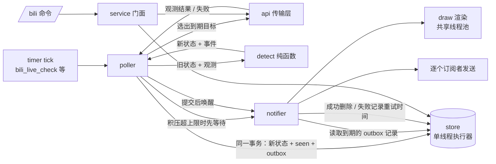

# B站订阅插件（bilibilibot）重构方案

> 面向执行人。文档按"先读背景 → 明确不能改坏的行为 → 按阶段实施"的顺序组织。
> 每个阶段都可以单独合并、单独回滚，不要求一次做完。

## 0. 一页摘要

- **已完成的止血**：后台轮询卡主进程的根因已经修复（见第 1.2 节）。原因是每个 HTTP 请求都新建 `httpx.AsyncClient`，同步加载 CA 证书约 1 秒。现在改成长连接客户端，加上进程级共享 SSL context。
- **还剩的问题**：风控刷新会被多个请求同时触发；单个目标的回退链没有总时限；直播逐个查询；检测、推送、持久化混在一个函数里；SQLite 在事件循环线程里同步读写；推送没有持久化，崩溃或发送失败就丢；`client.py` 约 830 行，职责过多。
- **目标形态**：拆成传输层（`api/`）、纯函数检测层（`detect.py`）、调度层（`poller.py`）、推送层（`notifier.py`，基于持久化 outbox）、异步存储（`store.py`）五层。命令入口和卡片渲染保持不变。
- **负责人已确认的决策**（详见第 8 节）：推送"至少一次"（outbox 表）；推送积压超过上限时让轮询等待，不丢消息；直播每轮同步主播昵称和头像；不使用关注流；`seen_items` 不清理；关注命令里的纯数字一律按 UID 解析。
- **用户可见的 bug**：`/bili follow all <UID>` 可能让视频和动态关注了正确的人，直播却关注了另一个人。原因是直播解析时先把数字当成直播间号去查，而 B站的 UID 和直播间号共用一个数字空间，大量数字两边都存在。修复方案：纯数字一律按 UID，按直播间号关注必须写 `room:` 前缀或贴直播间链接（第 5.6 节，阶段 0）。
- **收益最大的一步**：直播改用批量接口 `get_status_info_by_uids`。已实测：一次请求返回全部 23 个主播的状态，请求数从每分钟 23 次降到 1 次。
- **执行顺序**：阶段 0 修复关注错乱（独立，可立即做）→ 阶段 1 看门狗 → 阶段 2 传输层加固 → 阶段 3 直播批量 → 阶段 4 检测与推送解耦 → 阶段 5 异步存储 → 阶段 6 调度打散与退避 → 阶段 7 拆分 `client.py`。

---

## 1. 背景

### 1.1 现有结构

| 文件 | 行数（约） | 职责 |
|---|---|---|
| `plugins/bilibilibot/__init__.py` | 3 | 入口，`from .handlers import *` |
| `handlers.py` | 170 | 模块级创建 `store`、`client`、`service`；注册 `/bili` 命令、链接预览、5 个定时任务 |
| `service.py` | 340 | 订阅管理，三类轮询（`check_live`、`check_video`、`check_dynamic`），状态比对，推送（`broadcast`） |
| `client.py` | 830 | HTTP、WBI 签名、风控 cookie、直播/视频/动态/用户接口、RSSHub 回退、RSS 解析、链接解析、卡片字段映射 |
| `store.py` | 280 | 同步 `sqlite3`，表 `targets`、`subscriptions`、`seen_items`、`meta`，旧库迁移 |
| `draw.py` | 400 | PIL 渲染卡片，已通过 `run_image_render` 放进线程池，**本次不动** |
| `models.py` | 55 | `TargetInfo`、`Subscription`、`BiliCard` |

定时任务在 `handlers.py` 末尾注册：

| job id | 间隔 | 目标函数 |
|---|---|---|
| `bili_live_check` | 1 分钟 | `service.check_live` |
| `bili_video_check` | 2 分钟 | `service.check_video` |
| `bili_dynamic_check` | 1 分钟 | `service.check_dynamic` |
| `bili_wbi_refresh` | 1 小时 | `client.refresh_wbi_keys` |
| `bili_risk_cookie_refresh` | 6 小时 | `client.refresh_risk_cookies` |

`tests/test_architecture.py::test_all_plugins_load_in_real_entari_without_connecting` 会断言前三个 job id 存在。**重构后必须保留这三个 id**，否则就要同步修改该测试。

当前生产库（`data/bilibilibot/bilibili.db`）有 23 个活跃直播订阅，视频和动态订阅都是 0。所以直播路径最重要，视频和动态路径的改动风险相对低。

### 1.2 已完成的止血（本方案的前置条件）

**根因**：httpx 0.28 在 `verify=True` 时，每构造一个客户端或 transport 都会同步读取 certifi CA 包。本机（Windows）实测：

| 操作 | 耗时 |
|---|---|
| `httpx.AsyncClient()` 默认构造 | 约 1200 ms |
| 其中 `ssl.create_default_context(cafile=certifi)` | 约 1030 ms |
| `httpx.AsyncClient(verify=共享 ctx)` | 约 6 ms |

旧的 `BiliClient._get_json` 每次请求都执行 `async with httpx.AsyncClient(...)`，23 个直播目标意味着每分钟事件循环累计冻结 20 秒以上。

**已做的修改**（未提交，执行人接手时请确认已合入）：

1. 新增 `otae_bot/infrastructure/http/tls.py`：
   - `shared_ssl_context(trust_env=...)`：同步获取，带线程锁，进程内缓存。
   - `ashared_ssl_context(...)`：异步获取，未缓存时放进 `asyncio.to_thread` 构建。
   - `prewarm_shared_ssl_context()`：`otae_bot/application.py::main()` 启动时在后台线程预热。
2. `BiliClient` 持有一个长连接 `httpx.AsyncClient`（`_http()` 懒创建，事件循环变化时重建）。插件 `Cleanup` 时调用 `aclose()`。
3. cookie 语义保持不变：客户端和 `BiliClient.cookies` 共用同一个 `CookieJar`，jar 使用 `_SendOnlyCookiePolicy`（拒绝写入），**只发送配置的 cookie，不吸收响应里的 `Set-Cookie`**。
4. 仓库内其他每次请求都新建客户端的地方（`mcsm`、`grok_bot`、`peek`、`forkout`、`McModQuery`、`McWikiQuery`、`request_handler`、`hyw`、`endfield/account`、`adapters/onebot`、`infrastructure/http/client`）统一传入 `verify=共享 ctx`。
5. 实测修复后一轮 23 个直播请求：首轮事件循环最大卡顿 193 ms（首次建连），后续轮次 8 ms。

**本方案所有新代码都必须遵守**：不要在请求路径上 `httpx.AsyncClient(...)`。要么复用长连接客户端，要么至少传 `verify=await ashared_ssl_context(...)`。

---

## 2. 问题清单

按严重程度排序。"位置"指当前代码。

### P0：会导致卡顿或长时间占用资源

**P0-1 风控刷新会被同时触发多次（惊群）**
位置：`client.py::_get_json_with_risk_retry`、`refresh_risk_cookies`。
多个目标同时收到 -352 时，每个协程都会独立执行一次 `refresh_risk_cookies`（2 个请求）和 `refresh_wbi_keys`（1 个请求）。短时间内对 B站发出大量相同请求，反而更容易触发风控。后完成的刷新会覆盖先完成的结果。
（`self.cookies.clear()` 和 `update()` 之间没有 `await`，不会让其他协程读到空 jar，所以这里只有重复刷新的问题，不存在数据竞态。）

**P0-2 单个目标的回退链没有总时限**
位置：`client.py::latest_video` → `_fallback_latest_video` → `_rsshub_latest_video` → `_dynamic_latest_video` → `dynamic_items` → `_rsshub_latest_dynamic`。
最坏情况：主接口 15 s 超时 → 风控重试（3～4 个请求，每个最多 15 s）→ RSSHub（8 s）→ 动态接口（15 s + 风控重试）→ 动态 RSSHub（8 s）。一个目标可能超过 100 s，期间一直占着 `poll_concurrency` 的信号量槽位。

**P0-3 `/bili follow all <数字>` 时直播可能关注错人**
位置：`client.py::resolve_live_target`、`service.py::follow`。
同一个数字对三类订阅的含义不一致：视频和动态把它当 UID，直播却**先当直播间号**去查，查到就用该直播间主人的 UID。B站 UID 和直播间号共用同一个数字空间，大量数字两边都存在，于是直播订阅落到了另一个人身上。完整分析、实测证据和修复方案见第 5.6 节。

### P1：结构问题，放大故障影响

**P1-1 直播逐个查询**
位置：`service.py::_check_live_target` → `client.latest_live_state` → `live_card` → `_live_room`。每个目标每分钟 1 个请求。B站有批量接口，见第 5.2 节。

**P1-2 轮询和推送耦合**
位置：`service.py::_check_*_target` 里直接 `await self.broadcast(...)`。`broadcast` 会下载封面和头像、渲染 PNG、逐个订阅者发送。发送慢或渲染池被占满时，轮询 worker 会被一直占住。渲染池是全局共享的（`IMAGE_RENDER_CONCURRENCY = 2`），同时有多人开播时还会拖慢其他插件。

**P1-2b 推送没有持久化**
位置：`service.py::broadcast`。单个订阅者发送失败只打 warning，不重试；bot 未连接时整条通知直接丢失。另外现在是"先发送、后写库"，进程在两者之间崩溃会重复推送。负责人要求改成"至少一次"，见第 5.3 节 outbox 设计。

**P1-3 检测逻辑无法单独测试**
直播开播/下播判定和时长估算（`LIVE_TIMING_MAX_GAP_SECONDS` 相关分支）、动态去重、视频动态跳过等规则，都和 I/O 写在同一个函数里。现有测试只能靠替换 `service.broadcast`、`monkeypatch time.time` 来覆盖。

**P1-4 SQLite 在事件循环线程同步读写**
位置：`store.py` 全部方法，`service.py` 直接调用。每个目标每轮都执行 `upsert_target` + `commit`，库使用默认的 `journal_mode=delete`、`synchronous=FULL`。本机单次 commit 约 4 ms，目前影响不大，但磁盘慢或杀毒软件扫描时会被放大。

**P1-5 `service` 调用 `client` 的私有方法**
`service.py::_check_dynamic_target` 调用了 `self.client._dynamic_card_from_item`。

### P2：维护性与资源

- **P2-1** `seen_items` 表只增不删。**负责人已确认保持现状、不做清理**（数据量小，主键 `(kind, uid, item_id)` 已能支撑去重查询）。
- **P2-2** `client.py` 职责过多：传输、签名、风控、4 类接口、RSS 解析、链接解析、字段映射混在一起。
- **P2-3** 生命周期：`store`、`client`、`service` 和定时任务都在 import 时创建。止血改动已经在 `Cleanup` 里补上了 `client.aclose()`，但结构上仍然是模块级单例。
- **P2-4** `store.subscriptions_for_subscriber` 对每一行再调用 `get_target`，存在 N+1 查询（目前数据量小，顺手修）。
- **P2-5** 没有事件循环卡顿监控。这次问题靠人工排查才定位到，以后应该能自动报警。

---

## 3. 目标与非目标

### 目标

1. 任何一轮轮询都不能让事件循环单次卡顿超过 50 ms（以看门狗日志为准）。
2. 直播请求数与订阅数量无关：N 个主播每轮 ⌈N/批大小⌉ 个请求。
3. 单个目标的一次检查（包含全部回退）有硬性总时限，默认 30 s。
4. 风控刷新同一时间只进行一次，其他请求等待这次刷新的结果。
5. 检测逻辑是纯函数：输入旧状态和观测结果，输出新状态和事件，可以不依赖网络、数据库、时钟做单元测试。
6. 轮询和推送解耦：轮询只产生事件，推送由独立 worker 消费。
7. 数据库操作不在事件循环线程执行。

### 非目标

- 不改卡片样式（`draw.py`）。`tests/test_bilibili_cards.py` 必须原样通过。
- 不改命令结构（`/bili follow|unfollow|list|refresh|help`）。唯一例外是第 5.6 节：目标写法新增 `room:` 前缀，纯数字统一按 UID，成功回复补充 UID 和直播间号，帮助文本同步更新。
- 不改数据库已有表结构（只允许新增列、新增表、新增索引）。现有库必须能直接升级，不需要手动迁移。
- 不引入新的第三方依赖（不上 aiosqlite、APScheduler 等），用标准库加现有依赖实现。
- 不做"关注流拉取"（`feed/all`），它需要登录账号关注所有目标。**负责人已确认不做**，也不需要为它预留接口。
- 不清理 `seen_items`（负责人已确认）。

---

## 4. 必须保持的行为契约

以下行为都有现有测试覆盖，或属于用户可感知的行为。重构过程中**除第 4.5 节列出的确认变更外，任何一条变了都算回归**。

### 4.1 直播

1. 开播和下播只在**订阅轮询检测到状态变化**时推送，分别推送 `live_on` 和 `live_off` 卡片。
2. 链接预览（`card_for_link`）只展示当前状态：`live_on` 或 `live_idle`，**永远不产生 `live_off`**。
   相关测试：`test_room_preview_does_not_claim_a_stream_just_ended`。
3. 是否在直播由 `card_type == "live_on"` 决定，不看 `badge` 文案。
   相关测试：`test_live_state_follows_card_type_not_badge_copy`。
4. `live_on` 推送后，要对每个接收者紧跟着发一条纯文本直播间链接。
   相关测试：`tests/test_bilibili_notifications.py`。
5. 时长估算规则（`LIVE_TIMING_MAX_GAP_SECONDS = 180`）：
   - 只有"上一次成功观测到在播"距离本次不超过 180 s，并且 `0 < live_started_at <= live_last_seen_at` 时，下播卡片才带时长；否则显示"时长未知"。
   - 在播时，API 给出的开播时间无效，就沿用旧值（仅限最近一次观测仍然有效的情况）。
   - **轮询失败不能推进 `live_last_seen_at`，也不能发出下播通知。**
   - 相关测试：`tests/test_bilibili_live_duration.py` 全部用例。
6. `get_info` 返回的 `live_time` 是北京时间字符串（`YYYY-mm-dd HH:MM:SS`），解析必须固定按 UTC+8，和宿主机时区无关。只接受 `0 < ts <= now`。

### 4.2 视频与动态

7. 视频：`item_id` 与 `latest_id` 不同，并且没在 `seen_items` 里出现过，才推送。推送后写入 `seen_items`。
8. 动态：取最新 5 条，按发布时间升序处理。`published_at <= latest_ts` 或者已经在 `seen_items` 里的跳过。
9. 同一个 UP 同时订阅了"视频"时，动态里带 BV 号的条目只标记已读、不推送，避免重复推送。
   相关测试：`test_bili_service_check_dynamic_skips_video_dynamic_when_video_subscribed`、`..._sends_video_dynamic_without_video_subscription`。
10. 名称修正（**仅视频和动态**；直播见第 4.5 节）：只有当前名称为空或者等于 uid 时，才用接口返回的名字覆盖；用户自定义的名称不覆盖。头像只在为空时填充。
    相关测试：`test_bili_service_check_video_refines_uid_name_and_empty_avatar`、`..._does_not_override_custom_name`。
11. 同一个 uid 的视频检查失败日志 30 分钟内只打一次 warning，其余降级成 debug。
    相关测试：`test_bili_service_check_video_repeated_failures_are_throttled`。

### 4.3 传输与回退

12. 收到 -352 时：刷新风控 cookie，带签名参数的请求同时刷新 WBI key 并重新签名，然后重试一次。仍然是 -352 就抛 `BiliRiskControlError`，错误信息要提示配置 `BILI_SESSDATA`/`BILI_BUVID3`。
13. 风控刷新后，登录 cookie（`SESSDATA`、`buvid3`）必须保留。
    相关测试：`test_bili_client_login_cookies_are_preserved_after_risk_refresh`。
14. 配置了 `BILI_DM_IMG_*` 时，这些参数要参与视频列表请求的 WBI 签名。
15. 视频回退顺序：主接口 → 视频 RSSHub → 动态接口里的投稿条目。三者都失败时，错误信息要包含三段原因。
16. RSSHub：配置的实例排在默认实例前面，去重后并发请求，第一个成功就取消其余请求。全部失败时错误信息最多列 3 条，其余写成 "... and N more"。
17. cookie 只发送、不吸收（止血改动引入，有测试 `test_bili_client_reuses_http_client_and_keeps_cookies_send_only`）。

### 4.4 存储与命令

18. 旧库迁移（`bilibili_2.db` → `data/bilibilibot/bilibili.db`）继续可用，只迁移 live、video、dynamic 三类。
19. 旧表缺少 `live_started_at`、`live_last_seen_at` 列时要自动补上，不能丢失已有订阅。
20. `/bili follow all ...` 某一类失败时，不影响其他类订阅成功（例如这个 UID 没有直播间时，视频和动态照常订阅成功，直播单独报错）。
    相关测试：`test_bili_service_all_follow_keeps_live_when_video_dynamic_fail`。
21. 群聊订阅者类型为 `group`（优先取 guild id，其次 channel id），私聊为 `user`。

### 4.5 负责人确认的行为变更

以下几条是**有意**改变现状，需要写新测试，不算回归：

1. **直播昵称和头像每轮同步**：批量接口返回的 `uname`、`face` 非空时，直接覆盖本地 `name`、`avatar_url`（主播改名或换头像后自动跟上）。返回值为空时保留旧值，不能写成空字符串。视频和动态仍按第 4.2 节第 10 条执行。
2. **推送改为"至少一次"**：状态变化和待发通知在同一个事务里写库；进程崩溃或发送失败后会补发。代价是极端情况下同一条通知可能重复推送一次（见第 5.3 节 outbox）。
3. **单个订阅者发送失败会重试**（原来只打 warning 就放弃），重试策略见第 5.3 节。
4. **推送积压超过上限时，轮询会等待**积压消化后再继续，不丢弃通知。
5. **关注、取关、刷新命令里的纯数字一律按 UID 解析**（包括 `/bili follow live <数字>`）。按直播间号操作必须写 `room:<直播间号>` 或贴直播间链接。以前习惯用 `/bili follow live <直播间号>` 的用户需要改用新写法，帮助文本同步更新（第 5.6 节）。

### 4.6 必须全部通过的现有测试

- `tests/test_core_logic.py` 中所有 `test_bili_*` 用例
- `tests/test_bilibili_cards.py`
- `tests/test_bilibili_live_duration.py`
- `tests/test_bilibili_notifications.py`
- `tests/test_runtime_optimization.py::BilibiliPollingTests`（并发上限 4、单个目标失败不影响其他目标、轮询期间事件循环不被阻塞）
- `tests/test_http_client.py::SharedSslContextTests`（止血改动新增）
- `tests/test_architecture.py`（job id 断言）

> 这些测试大量使用 `service.broadcast = AsyncMock()`、`service._check_live_target(...)`、同步 `BiliStore`。接口变化时，允许把测试改写成新接口，但**断言的行为不能删减**。改写时请逐条对照第 4 节。

> 已知与本方案无关的失败（2026-09-25 在原始代码上同样出现，不要误判为回归）：
> - `tests/test_architecture.py::test_all_plugins_load_in_real_entari_without_connecting`：插件列表排序断言（大小写敏感排序和大小写不敏感排序不一致），不是加载失败。
> - `tests/test_grok_bot.py` 中 `test_total_task_timeout_cancels_read_backoff_without_new_prompt`、`test_early_publish_rejects_intervening_input_and_missing_anchor`，以及 `tests/test_grok_stream.py::test_total_receiver_timeout_reports_once_without_resubmitting`：时序敏感。
> - `tests/test_changelog.py::DataIntegrityTests`：依赖 git 提交历史与 changelog 数据同步。
> - `tests/test_endfield_stage.py::test_stage_card_cache_key_includes_revision`：与当时本地未提交的 endfield 改动有关。
> - `tests/test_runtime_optimization.py::test_twenty_four_targets_use_four_workers_and_isolate_failures`：心跳间隔阈值 0.1 s，在 Windows 上偶发超出（实测 0.113 s）。阶段 4 迁移时建议把阈值放宽，或者改成统计多次心跳的中位数。
> - 在 Windows 上跑测试需要设置 `PYTHONUTF8=1`，否则 `tests/test_endfield_followup_fixes.py` 会在收集阶段报 GBK 解码错误。

---

## 5. 目标架构

### 5.1 目录与职责

```
plugins/bilibilibot/
  __init__.py        # 不变
  handlers.py        # 命令解析、链接预览、生命周期、定时任务注册（保留原 job id）
  service.py         # 命令用门面：follow / unfollow / refresh / list_subscriptions / preview_link
  poller.py          # 调度：每类一个 tick；目标选择、并发、单目标总超时、失败退避
  refs.py            # 纯函数：解析命令里的目标写法（UID / room: / 链接），见第 5.6 节
  detect.py          # 纯函数：旧状态 + 观测结果 → 新状态 + 事件（不做任何 I/O，不读时钟）
  notifier.py        # outbox 消费者：取待发记录，渲染一次，逐个订阅者发送，失败重试
  store.py           # 专用单线程执行器上的 sqlite（含 outbox 表）；对外全是 async 方法
  models.py          # 现有模型 + 新增 LiveObservation、BiliEvent、SeenItem、OutboxRow
  draw.py            # 不变
  api/
    __init__.py      # 导出 BiliApi（组合下面的模块）
    session.py       # 长连接客户端、cookie jar、WBI key、风控刷新（同一时间只刷一次）、限速
    wbi.py           # 签名纯函数（从 client._wbi_sign 移出）
    live.py          # 批量直播状态、单房间信息、live_time 解析
    space.py         # 用户信息、视频列表、视频详情、动态 feed、回退链
    rsshub.py        # RSSHub 并发竞速 + RSS/Atom 解析
    links.py         # 链接解析、短链展开
    mapping.py       # 接口 JSON → BiliCard / LiveObservation（纯函数）
  client.py          # 过渡期保留：对 api/ 的薄兼容层，阶段 7 结束后删除
```

### 5.2 数据流



关键约束：

- `poller` 是唯一把 api、detect、store 串起来的地方；它和 notifier 之间只有"唤醒"和"等待积压消化"两个交互，通知内容全部经过 outbox 表传递。
- `detect` 不 import `api`、`store`、`notifier`、`time`。当前时间由调用方以参数 `now` 传入。
- `notifier` 不回写 `targets` 状态，只读写 outbox 表和读取订阅关系。
- 命令路径（`service`）不经过 `notifier`：命令回复是同步问答。链接预览直接渲染后回复。

### 5.3 模块接口

以下签名是建议，执行人可以调整命名，但职责边界请保持。

#### `api/session.py`

```python
class BiliSession:
    def __init__(self, *, timeout: float = 10, sessdata: str = "", buvid3: str = "",
                 transport: httpx.AsyncBaseTransport | None = None,
                 min_interval: float = 0.2): ...

    async def get_json(self, url: str, *, params=None, label: str,
                       signed: bool = False) -> dict:
        """统一入口：限速 → 请求 → -352 时刷新（同一时间只刷一次）后重试一次 → code 校验。"""

    async def post_json(self, url: str, *, json=None, label: str) -> dict: ...
    async def get_text(self, url: str, *, timeout: float | None = None) -> str: ...  # RSSHub
    async def head_location(self, url: str) -> str: ...                              # 短链展开

    async def ensure_wbi_keys(self) -> None: ...
    async def refresh_risk_cookies(self) -> None: ...
    async def aclose(self) -> None: ...
```

实现要点：

- **长连接客户端**：沿用止血改动的 `_http()` 写法（事件循环变化时重建，`verify=await ashared_ssl_context(trust_env=False)`，cookies 传共享的 `CookieJar`）。
- **风控刷新同一时间只进行一次**：用"代数"计数判断别人是否已经刷新过。

  ```python
  async def _refresh_risk_once(self, seen_generation: int) -> None:
      async with self._risk_lock:
          if self._risk_generation != seen_generation:
              return  # 等锁期间别人已经刷新过，直接用新 cookie 重试
          await self._do_refresh_risk_cookies()
          self._risk_generation += 1
  ```

  请求开始前记下 `gen = self._risk_generation`，收到 -352 后调用 `_refresh_risk_once(gen)`，再重试。WBI key 刷新用同样的模式。
- **`asyncio.Lock` 与事件循环绑定**：和 `_http()` 一样在事件循环变化时重建，否则测试里多次 `asyncio.run` 会报错。
- **限速**：对 `api.bilibili.com` 和 `api.live.bilibili.com` 设最小请求间隔（默认 200 ms，可以用一个 `asyncio.Lock` 加上次请求时间实现），降低触发风控的概率。RSSHub 不限速。
- **风控专用客户端**：风控刷新需要临时 cookie 和不同的请求头，继续用短生命周期客户端，但必须传共享 SSL ctx。同时把 `client.get(..., cookies=temp)` 改成用该临时客户端自己的 jar，避免 httpx 0.28 的 per-request cookies 弃用警告。
- **不要用 per-request `cookies=` 参数**（httpx 0.28 已弃用）。

#### `api/live.py`

```python
async def batch_live_status(session, uids: list[str], *, chunk: int = 50) -> dict[str, LiveObservation]:
    """uid → 观测结果。返回里缺失的 uid 视为"本轮未观测到"，不要当成下播。"""

async def room_info(session, room_id: str) -> dict: ...  # 现有 get_info，供链接预览、follow、批量失败回退
def parse_beijing_live_time(value: str, now: int) -> int: ...  # 现有 _live_start_timestamp 的逻辑
```

批量接口（2026-09-25 实测可用，POST JSON 和 GET `uids[]` 都返回 code 0，23/23 命中）：

```
POST https://api.live.bilibili.com/room/v1/Room/get_status_info_by_uids
Body: {"uids": [8181318, ...]}
Resp: {"code": 0, "data": {"8181318": {...}, ...}}
```

单条字段：`uid, room_id, short_id, uname, face, title, live_status, live_time, cover_from_user, keyframe, online, area_name, area_v2_name, tags, tag_name, broadcast_type, hidden_till, lock_till, ...`

字段映射到 `LiveObservation`：

| LiveObservation 字段 | 来源 | 说明 |
|---|---|---|
| `uid` | `uid` | 转成 str |
| `room_id` | `room_id` | 转成 str |
| `is_live` | `live_status == 1` | **0 表示未开播，2 表示轮播，两者都算"未直播"**，和现有 `get_info` 的判定一致 |
| `title` | `title` | |
| `cover` | `cover_from_user` 或 `keyframe` | 现有逻辑是 `user_cover or cover` |
| `started_at` | `live_time` | **这里是 unix 秒，不是北京时间字符串**；只接受 `0 < ts <= now`，否则记 0 |
| `uname` / `face` | `uname` / `face` | **每轮同步**：非空时覆盖本地 `name`、`avatar_url`；为空时保留旧值（第 4.5 节第 1 条） |

需要执行人确认的点：

- 单批上限。已验证 23 个可以；默认 `chunk=50`，上线前用更大的列表压测一次，超限就调小。
- 批量请求整体失败（网络错误、code ≠ 0）时，退回逐个 `room_info`，但要在 poller 里受并发和总时限约束。
- 某个 uid 在返回里缺失（没有直播间或被封）：本轮当作"未观测"，**不改状态、不推进 `live_last_seen_at`、不发下播通知**（第 4 节第 5 条）。

#### `api/space.py`

```python
async def user_info(session, uid) -> dict: ...
async def latest_video(session, uid, *, deadline: float) -> BiliCard: ...   # 含回退链
async def dynamic_items(session, uid, *, deadline: float) -> list[dict]: ...
async def video_by_bvid(session, bvid) -> BiliCard: ...
```

- **回退链遵守截止时间**：回退链整体接收绝对截止时间 `deadline`（`loop.time()` 值），每一步用 `asyncio.timeout_at(deadline)` 包裹，时间用完就立即停止并抛出汇总错误。
- **不再调用私有方法**：`_dynamic_card_from_item` 移到 `api/mapping.py`，改名为公开的 `dynamic_item_to_card`。

#### `detect.py`（纯函数）

```python
@dataclass(slots=True)
class BiliEvent:
    kind: str                   # live / video / dynamic
    uid: str
    card: BiliCard
    seen: SeenItem | None = None

def detect_live(prev: TargetInfo, obs: LiveObservation | None, now: int
                ) -> tuple[TargetInfo, list[BiliEvent]]:
    """obs 为 None 表示本轮失败或未观测：返回 (prev, [])，不做任何推进。"""

def detect_video(prev: TargetInfo, latest: BiliCard, *, already_seen: bool
                 ) -> tuple[TargetInfo, list[BiliEvent]]: ...

def detect_dynamic(prev: TargetInfo, cards: list[BiliCard], *, seen_ids: set[str],
                   video_subscribed: bool) -> tuple[TargetInfo, list[BiliEvent], list[SeenItem]]:
    """第三个返回值是"只标记已读、不推送"的条目（视频动态跳过）。"""
```

- 把 `service.py::_check_live_target` 中 `recent_live_observation`、`duration` 的计算原样搬进 `detect_live`，**逐行对照迁移**。然后把 `tests/test_bilibili_live_duration.py` 的场景改写成直接调用 `detect_live` 的参数化测试。
- 名称修正（`_refined_name`）、视频动态判定（`_bvid_from_card`）也移进 `detect.py`。

#### `poller.py`

```python
class Poller:
    def __init__(self, api: BiliApi, store: BiliStore, notifier: Notifier, *,
                 concurrency: int = 4, target_timeout: float = 30,
                 clock: Callable[[], float] = time.time): ...

    async def tick_live(self) -> None: ...     # 挂在 bili_live_check
    async def tick_video(self) -> None: ...    # 挂在 bili_video_check
    async def tick_dynamic(self) -> None: ...  # 挂在 bili_dynamic_check
```

每个 tick 的流程：

1. 同一类的上一轮还没结束，就跳过本轮（保留现有 `_poll_locks` 语义和 `skipped=overlap` 日志）。
2. **积压检查**：`await notifier.wait_backlog_below(high_watermark)`。outbox 待发记录数达到上限时在这里等待，直到降下来再继续（负责人确认：阻塞轮询，不丢通知）。等待放在**取数之前**，保证等完之后拿到的是最新状态。等待期间后续 tick 会因为第 1 步被跳过，这是预期行为。
3. `targets = await store.list_active_targets(kind)`。
4. 直播：一次 `batch_live_status`，逐个 `detect_live`。
   视频和动态：从中筛出已到期的目标（`next_due <= now`，见第 5.4 节），用信号量限制并发，每个目标包 `asyncio.timeout(target_timeout)`。
5. 把所有新状态、`SeenItem`、事件汇总后，调用一次 `await store.apply_poll_result(targets, seen, events, now)`。**同一个事务里**完成：更新 `targets`、写入 `seen_items`、按当前订阅关系把每个事件展开成每个接收者一条 outbox 记录。
6. 事务提交后调用 `notifier.wake()`。
7. 打印汇总日志：`kind`、`targets`、`due`、`success`、`failed`、`events`、`backlog_wait`、`elapsed`（保留现有格式并补充字段）。

**投递语义："至少一次"（负责人已确认）。** 状态变化和待发通知原子地一起落库，所以：

- 进程在提交之前崩溃：状态没变，下一轮会重新检测到同一个变化，重新产生事件。
- 进程在提交之后、发送之前崩溃：outbox 记录还在，重启后 notifier 补发。
- 进程在"图片已发、记录未删"时崩溃：重启后这个接收者会再收到一次（重复一次，这是"至少一次"的代价）。`live_on` 的"图片 + 链接"两条消息属于同一条记录，崩溃在两条之间时两条都会重发。

#### `notifier.py`

```python
class SenderUnavailable(Exception):
    """bot 未连接等"整体不可发送"的情况；不消耗重试次数。"""

class Notifier:
    def __init__(self, store: BiliStore, *, render: Callable[[BiliCard], Awaitable[bytes]],
                 send: Callable[[OutboxRow, bytes], Awaitable[None]],
                 concurrency: int = 2, high_watermark: int = 500,
                 clock: Callable[[], float] = time.time): ...
    def wake(self) -> None: ...                                  # poller 提交后调用
    async def wait_backlog_below(self, limit: int | None = None) -> None: ...
    async def start(self) -> None: ...                           # 启动即处理上次遗留的记录
    async def stop(self, drain_timeout: float = 10) -> None: ... # 未发完的留在库里，下次启动继续
```

**调度循环**（单个 dispatcher 协程）：

1. 被 `wake()` 唤醒，或者每 5 s 醒一次（处理到期的重试）。
2. 先执行过期清理（见下文"过期"），再用 `store.due_outbox(now, limit=50)` 取出到期记录。**每个接收者只取 id 最小的一条**，保证同一个群内按产生顺序收到通知，比如 `live_on` 一定先于 `live_off`。前一条还在重试等待时，后面的记录也要等。
3. 不同接收者之间并发发送（上限 `concurrency`），同一接收者串行。现有的 `_broadcast_locks` 语义由"每个接收者只取头一条"天然保证。
4. 按 `event_key` 在内存里缓存渲染结果（LRU，约 32 条），同一事件发给多个群只渲染一次。进程重启后缓存丢失，重新渲染即可。

**单条记录的处理结果**：

| 结果 | 处理 |
|---|---|
| 发送成功 | `store.outbox_done(id)` 删除记录 |
| `send` 抛 `SenderUnavailable`（bot 未连接） | 不增加 `attempts`，`next_attempt_at = now + 10 s`，打 debug 日志 |
| `send` 抛其他异常 | `attempts += 1`，`next_attempt_at = now + min(30 * 2 ** (attempts - 1), 600)` 秒，记录 `last_error`，打 warning |
| `attempts` 达到 8 次（累计约 1 小时） | 删除记录，打 error 日志（含接收者、`event_key`、最后一次错误），不再重试 |

**过期**：直播通知晚到几个小时会误导人（主播早就下播了），所以按类型设最长存活时间，超过就删除并打 warning：`live_on`、`live_off` 为 2 小时，视频和动态为 24 小时。这两个值是默认值，写成常量，执行人可以调整。

**积压等待**：`wait_backlog_below` 在 outbox 行数 ≥ `high_watermark`（默认 500）时阻塞，直到行数降到上限以下。行数通过 `store.outbox_count()` 获取，每次 dispatcher 处理完一批后通知等待者重新检查。bot 长时间离线时，过期清理会让积压最终降下来，轮询不会被永久卡住。

**其他要求**：

- `send` 和 `render` 通过构造参数注入，测试时不依赖 entari。handlers 负责把 `get_bot()`、`ChainMsg`、`SendDest` 包装成 `send`：`get_bot()` 失败时抛 `SenderUnavailable`；`live_on` 且 `url` 非空时，发完图片后再发一条纯文本链接（保留第 4.1 节第 4 条）。
- 临时 PNG 文件继续用 `schedule_temp_file_cleanup`。更好的做法是 `make_image(raw=png)` 直接传字节，省掉写盘；需要先确认 `make_image(raw=...)` 在当前适配器上能正常发送。

#### `store.py`

```python
class BiliStore:
    def __init__(self, db_path=DB_PATH, legacy_db_path=LEGACY_DB_PATH): ...
    async def open(self) -> None: ...   # 在执行器线程里建连接、建表、迁移
    async def close(self) -> None: ...
    async def list_active_targets(self, kind: str) -> list[TargetInfo]: ...
    async def apply_poll_result(self, targets: list[TargetInfo], seen: list[SeenItem],
                                events: list[BiliEvent], now: int) -> int: ...  # 返回写入的 outbox 行数
    async def seen_ids(self, kind: str, uid: str, item_ids: list[str]) -> set[str]: ...

    # outbox
    async def due_outbox(self, now: int, limit: int) -> list[OutboxRow]: ...  # 每个接收者只取 id 最小的一条
    async def outbox_done(self, row_id: int) -> None: ...
    async def outbox_retry(self, row_id: int, *, attempts: int, next_attempt_at: int, error: str) -> None: ...
    async def outbox_drop(self, row_id: int) -> None: ...
    async def outbox_expire(self, now: int, max_age: dict[str, int]) -> int: ...  # 按 card_type 过期
    async def outbox_count(self) -> int: ...

    # 以及现有的 get_target / upsert_target / add_subscription / remove_subscription /
    # subscriptions_for_target / subscriptions_for_subscriber，全部改成 async
```

新增 outbox 表（`init_schema` 里 `CREATE TABLE IF NOT EXISTS`，老库自动升级）：

```sql
CREATE TABLE IF NOT EXISTS outbox (
    id INTEGER PRIMARY KEY AUTOINCREMENT,
    event_key TEXT NOT NULL,          -- 同一事件的所有接收者相同，用于渲染缓存和日志
    kind TEXT NOT NULL,
    uid TEXT NOT NULL,
    card_type TEXT NOT NULL,          -- 用于按类型过期
    subscriber_type TEXT NOT NULL,
    subscriber_id TEXT NOT NULL,
    card_json TEXT NOT NULL,          -- dataclasses.asdict(BiliCard) 的 JSON
    created_at INTEGER NOT NULL,
    attempts INTEGER NOT NULL DEFAULT 0,
    next_attempt_at INTEGER NOT NULL,
    last_error TEXT NOT NULL DEFAULT '',
    UNIQUE(event_key, subscriber_type, subscriber_id)
);
CREATE INDEX IF NOT EXISTS idx_outbox_recipient ON outbox(subscriber_type, subscriber_id, id);
CREATE INDEX IF NOT EXISTS idx_outbox_due ON outbox(next_attempt_at);
```

- **每个接收者一行**：事件在写入时就按当时的订阅关系展开。崩溃时只会重发给还没发完的接收者，不会全体重发。事件产生后才取消订阅的接收者仍会收到这一条，可以接受。
- **`event_key` 规则**：视频和动态为 `{kind}:{uid}:{item_id}`；直播为 `live:{uid}:{card_type}:{now}`。`UNIQUE` 约束兜底，防止同一事件重复写入。
- **`card_json` 反序列化**：`BiliCard(**json.loads(card_json))`。以后给 `BiliCard` 加字段时必须带默认值，否则老记录无法还原。

- **单线程执行器**：`ThreadPoolExecutor(max_workers=1, thread_name_prefix="bili-sqlite")`，**在这个执行器线程里**创建 `sqlite3.connect`（sqlite 连接默认不能跨线程使用）。所有操作通过 `loop.run_in_executor(self._executor, fn)` 提交，天然串行。
- **打开连接后执行**：`PRAGMA journal_mode=WAL`、`PRAGMA synchronous=NORMAL`。
- **修掉 N+1 查询**：`subscriptions_for_subscriber` 改成一条 `LEFT JOIN`。
- **`seen_items` 不清理**（负责人已确认），也不需要新增索引。
- **测试辅助**：保留同步的 `_sync_*` 私有实现，方便测试直接调用；公开接口一律 async。

#### `handlers.py`

- **模块级对象**：可以继续在模块级创建 `api`、`store`、`notifier`、`poller`、`service`，但把 `store.open()`、`notifier.start()` 放进 `on_ready`，`Cleanup` 里按顺序执行：`close_scheduled_jobs()` → `notifier.stop()` → `api.aclose()` → `store.close()`。
- **定时任务**：job id 保持 `bili_live_check`、`bili_video_check`、`bili_dynamic_check`、`bili_wbi_refresh`、`bili_risk_cookie_refresh`，目标函数换成 `poller.tick_*` 和 session 的刷新方法。
- **`store` 未打开时**（`on_ready` 之前触发了 tick）：直接返回并打 debug 日志。

### 5.4 调度打散与失败退避（视频/动态）

目前视频和动态订阅数为 0，这一节优先级低，但要在架构上预留：

- **打散**：在内存里给每个目标维护 `next_due`。首次调度时间 = `now + hash(uid) % interval`，把请求均匀分散到整个周期里，避免每分钟整点集中请求。
- **成功**：`next_due = now + interval`。
- **失败**：`next_due = now + min(interval * 2 ** failures, 30 min)`，成功后 `failures` 清零。
- **状态保存**：只放内存，重启后重新打散即可，不需要持久化。
- **直播不做退避**：批量接口一次请求覆盖所有人，失败了下一分钟重试就行。

### 5.5 可观测性

- **事件循环看门狗**（放在 `otae_bot/infrastructure`，所有插件受益）：后台任务每 0.5 s `await asyncio.sleep(0.5)`，测量实际耗时。超出 200 ms 打 warning，带当前时间，方便和其他日志对照；超出 1 s 升级为 error。在 `application.py` 启动，在 `Cleanup` 里取消。
- **轮询汇总日志**：每轮一行，字段见第 5.3 节 poller 部分。
- **outbox 日志**：记录重试（warning）、达到上限放弃（error）、过期删除（warning）；积压等待开始和结束各打一行 info，带当时的积压行数。
- **可选**：超级用户命令 `/bili status`，输出各类目标数、上一轮耗时、失败数、风控刷新次数、outbox 积压行数、最老一条记录的时间。

### 5.6 订阅目标解析：修复 UID 与直播间号错乱

#### 现象

执行 `/bili follow all 10406554`（10406554 是某位主播的 UID），视频和动态关注的是 UID 10406554，直播却关注了 UID 12598817，一个完全不相干的人。

#### 原因

`service.follow` 对每个输入值、每一类订阅分别调用 `resolve_target(kind, value)`，同一个数字被三次独立解析：

- 视频和动态：`resolve_video_target` / `resolve_dynamic_target` 把数字当 **UID**。
- 直播：`resolve_live_target` **先把数字当直播间号**调用 `Room/get_info?room_id=<数字>`；只要这个直播间存在，就取直播间主人的 UID 作为订阅对象。只有直播间不存在时，才退回按 UID 调用 `Master/info?uid=<数字>`。

```python
# client.py::resolve_live_target（现状）
live_by_room = await self._live_room(value)          # 先当直播间号
if live_by_room and str(live_by_room.get("uid") or ""):
    uid = str(live_by_room["uid"])                   # 用直播间主人的 UID，可能不是 value
    ...
profile = await self._live_user(value)               # 直播间不存在才当 UID
```

B站 UID 和直播间号是两套独立编号，但共用同一个数字空间，而且 `get_info` 还接受短号（比如直播间 `1` 是某个长号直播间的短号），撞号非常普遍。2026-09-25 实测：

| 输入的数字 | 当作直播间号 → 直播间主人 UID | 当作 UID → 本人直播间号 | 结果 |
|---|---|---|---|
| `1` | 9617619 | 553241 | 撞号 |
| `1000` | 227933 | （无直播间） | 撞号 |
| `10406554` | 12598817 | 5302860 | 撞号（库里现有订阅的 UID） |
| `12092154` | 179405281 | 336185 | 撞号（库里现有订阅的 UID） |
| `2135798` | 14488733 | 160982 | 撞号（库里现有订阅的 UID） |
| `240294` | 21660369 | 8598763 | 撞号（库里现有订阅的 UID） |
| `25819634` | 1283412328 | 527840 | 撞号（库里现有订阅的 UID） |
| `2606266` | 39874491 | 40186 | 撞号（库里现有目标，当前无人订阅） |
| `114514` | （直播间不存在） | 10077556 | 碰巧正确 |
| `135116630` | （直播间不存在） | 22852021 | 碰巧正确 |

库里 24 个直播目标全部核查，有 8 个 UID 会撞号（其中 7 个当前有人订阅，另外还有 `4503930`、`8181318` 未列入上表）。也就是说，今天有人用 `/bili follow all <这些 UID>` 重新关注，直播都会关注错人。

同一个根因还导致另外两个问题：

- **`/bili refresh live <数字>`**：同样先按直播间号解析，会刷新（或者新建）另一个人的目标记录，回复里显示的是别人的名字。
- **`/bili unfollow live <数字>`**：取关时按 UID 在库里查（`store.get_target(kind, value)`）。如果当初输入的数字被当成了直播间号，库里存的是直播间主人的 UID，用同一个数字取关会提示"未订阅"，用户取关不掉。
- **不容易发现**：成功回复只显示名字（`直播 某某 已订阅`），不显示 UID 和直播间号，用户很难察觉关注错了人。

#### 现有数据核查（2026-09-25）

生产库 30 条订阅全部是直播，全部在 2026-05-25 20:40:13 由旧库迁移写入（`meta.legacy_migrated = 1`），之后没有通过命令新增过订阅。24 个直播目标逐个核对，每个 UID 调用 `Master/info` 得到的直播间号都与库里的 `room_id` 一致（24/24）。**现有数据没有关注错的记录，不需要修数据。**

注意：关注错的记录本身是"自洽"的（存的是直播间主人的 UID 和那个直播间），单看直播目标无法识别。只有同一次命令同时写入了视频或动态订阅时，才能通过"同一订阅者、同一 `created_at`、视频/动态 UID ≠ 直播 UID"来发现。其他部署如需核查，可以按这个规则写一个只读脚本。

#### 修复方案（负责人已确认：纯数字一律按 UID）

**1. 统一的目标写法解析**：新增纯函数模块 `plugins/bilibilibot/refs.py`。

```python
@dataclass(frozen=True, slots=True)
class TargetRef:
    by: Literal["uid", "room"]
    value: str           # 纯数字字符串
    raw: str             # 用户原始输入，用于回复

def parse_target_ref(raw: str) -> TargetRef:
    """无法识别时抛 ValueError，错误信息直接回复给用户。"""
```

| 用户输入 | 解析结果 |
|---|---|
| `114514` | UID 114514 |
| `uid:114514`、`UID:114514` | UID 114514 |
| `https://space.bilibili.com/114514`（可带路径和查询参数） | UID 114514 |
| `room:5302860`、`ROOM:5302860` | 直播间 5302860 |
| `https://live.bilibili.com/5302860`、`https://live.bilibili.com/blanc/5302860?...` | 直播间 5302860 |
| 其他（非数字、b23.tv 短链等） | 报错：`无法识别 "xxx"，请使用 UID、room:直播间号 或直播间链接` |

b23.tv 短链需要网络展开，不在纯函数里处理；如需支持，放在 service 层先展开再调用 `parse_target_ref`。首版不支持即可。

**2. 拆开直播解析的两条路径，删除"猜测"逻辑**：

```python
async def resolve_live_by_uid(uid: str) -> TargetInfo:
    """Master/info?uid=...；该 UID 没有直播间时抛 BiliAPIError("UID xxx 没有直播间")。"""

async def resolve_live_by_room(room_id: str) -> TargetInfo:
    """Room/get_info?room_id=...（接受短号）；直播间不存在时抛 BiliAPIError。
    返回的 TargetInfo.uid 是直播间主人的 UID，room_id 是长号。"""
```

`resolve_live_target(value)` 这个"先猜直播间号"的函数整体删除，所有调用点改成显式调用上面两个函数之一：

| 调用点 | 改成 |
|---|---|
| `service.follow` / `refresh`，输入是 UID | `resolve_live_by_uid` |
| `service.follow` / `refresh`，输入是 `room:` 或直播间链接 | `resolve_live_by_room` |
| `client.card_for_link`（聊天里的直播间链接预览） | `resolve_live_by_room`。**这里必须改，否则链接预览会把直播间号当 UID 查，直接坏掉** |

现有测试 `test_subscribing_mid_stream_keeps_api_start_in_both_resolution_routes` 覆盖的"两条解析路径"分别对应这两个新函数，改名后保留两条用例。

**3. `follow` 的处理顺序**：每个输入值**只解析一次**，得到一个确定的 UID，再用这个 UID 订阅各类。

```
for raw in values:
    ref = parse_target_ref(raw)
    if ref.by == "room":
        if kind 只有 video 或 dynamic → 失败："直播间号只能用于 live 或 all"
        live_target = await resolve_live_by_room(ref.value)
        uid = live_target.uid                    # all + room：三类都订阅这个直播间的主人
    else:
        uid = ref.value
    for kind in kinds:
        target = 直播且已解析过 ? live_target : await resolve_target_by_uid(kind, uid)
        assert target.uid == uid                 # 兜底：不一致就让这一类失败，绝不订阅到别人
        ...
```

- `all` + 纯数字：三类都按 UID。这个 UID 没有直播间时，直播单独报错，视频和动态照常成功（第 4 节第 20 条）。
- `all` + `room:`：先解析出直播间主人，三类都订阅这个人。
- `video` / `dynamic` + `room:`：直接报错，不做隐式转换。
- 兜底断言：任何一类解析出来的 UID 和期望的 UID 不一致，这一类记为失败并打 error 日志，不写订阅。以后再有人引入类似的"猜测"逻辑，也不会静默关注错人。

**4. `unfollow` 和 `refresh` 用同一套解析**：

- 纯数字、`uid:`、空间链接：按 UID 查找和取关。
- `room:`、直播间链接：按直播间号查找直播目标（`store` 新增 `get_live_target_by_room(room_id)`，同时匹配长号；短号需要先调用 `resolve_live_by_room` 换成长号），再按它的 UID 取关。只允许用于 `live` 和 `all`。

**5. 回复里写明 UID 和直播间号**，让用户一眼看出关注的是谁：

```
B站订阅结果
成功:
- 直播 某主播（UID 10406554，直播间 5302860）已订阅
- 视频 某主播（UID 10406554）已订阅
- 动态 某主播（UID 10406554）已存在
```

按直播间号关注时额外注明来源：`直播 某主播（UID 12598817，直播间 10406554，按直播间号解析）已订阅`。

**6. 帮助文本同步更新**（`handlers.py` 里 `/bili help` 的内容）：

```
用法:
/bili follow <all|live|video|dynamic> <UID> [更多UID]
/bili follow <all|live> room:<直播间号>    （或直接贴直播间链接）
/bili unfollow <all|live|video|dynamic> <UID 或 room:直播间号>
/bili list [all|live|video|dynamic]
/bili refresh <all|live|video|dynamic> <UID 或 room:直播间号>
提示：纯数字一律按 UID 处理；按直播间号操作请加 room: 前缀。
```

#### 需要新增的测试

全部用 `httpx.MockTransport` 构造"撞号"场景：`get_info?room_id=N` 返回主人 UID 999，`Master/info?uid=N` 返回直播间 555。

- `parse_target_ref`：上表每一行，以及非法输入的报错文案。
- `follow all N`：三类订阅的 UID 都是 N；直播目标的 `room_id` 是 555。
- `follow live N`：直播订阅 UID 为 N（行为变更，旧逻辑会得到 999）。
- `follow live room:N`：直播订阅 UID 为 999。
- `follow all room:N`：三类订阅的 UID 都是 999。
- `follow video room:N`：失败，提示直播间号只能用于 live 或 all。
- `follow all N`，N 没有直播间：直播失败并提示"没有直播间"，视频和动态成功。
- 兜底断言：伪造一个返回错误 UID 的解析函数，断言这一类不会写入订阅。
- `unfollow live room:N`：取关 UID 999 的直播订阅；`unfollow live N`：取关 UID N 的直播订阅。
- `refresh live N`：只刷新 UID N 的目标，不产生 UID 999 的记录。
- 链接预览 `https://live.bilibili.com/N`：展示的是 UID 999 的直播间（回归测试）。
- 成功回复里包含 UID 和直播间号。

---

## 6. 分阶段实施

每个阶段都要求：第 4.6 节列出的测试全部通过；新增的测试通过；独立提交。

### 阶段 0：修复关注错乱（独立，可立即执行，约 1 天）

这是用户可见的正确性 bug，不依赖后续任何阶段，建议最先做、单独上线。

- 新增 `refs.py::parse_target_ref`（第 5.6 节第 1 点）。
- `client.py`：把 `resolve_live_target` 拆成 `resolve_live_by_uid`、`resolve_live_by_room`，删除原函数；`card_for_link` 改用 `resolve_live_by_room`。
- `service.py`：`follow`、`unfollow`、`refresh` 按第 5.6 节第 3、4 点重写，加兜底断言。
- `store.py`：新增 `get_live_target_by_room`。
- `handlers.py`：更新 `/bili help` 文本（第 5.6 节第 6 点），成功回复带 UID 和直播间号（第 5.6 节第 5 点）。
- **新增测试**：第 5.6 节"需要新增的测试"全部用例。
- **需要同步修改的现有测试**（引用了被删除的 `resolve_live_target`）：
  - `tests/test_core_logic.py::test_bili_service_all_follow_keeps_live_when_video_dynamic_fail`：其中 `FakeClient.resolve_live_target` 改成 `resolve_live_by_uid`，断言不变。
  - `tests/test_bilibili_live_duration.py::test_subscribing_mid_stream_keeps_api_start_in_both_resolution_routes`：按 `resolve_by_uid` 参数分别调用 `resolve_live_by_uid("123")` 和 `resolve_live_by_room("456")`，断言不变。
- **验收**：
  - 在测试群执行 `/bili follow all 10406554`，回复里直播、视频、动态三行的 UID 都是 10406554，直播间是 5302860。
  - `/bili follow live room:10406554` 回复 UID 12598817，并注明"按直播间号解析"。
  - 聊天里发 `https://live.bilibili.com/5302860`，链接预览仍然正常。
  - 验收后用 `/bili unfollow` 清理测试订阅。
- **上线通知**：`/bili follow live <直播间号>` 的旧写法改变了含义，上线时在常用群里说明一下新写法。
- **回滚**：还原本阶段提交。没有数据库结构变更。

### 阶段 1：事件循环看门狗（约 0.5 天）

- 新增 `otae_bot/infrastructure/loop_watchdog.py`，在 `application.py` 中启动。
- 单元测试：在循环里人为 `time.sleep(0.3)`，断言看门狗打出 warning（用 `loguru` 的 sink 捕获）。
- **验收**：本地运行 bot 30 分钟，没有 B站相关的超过 200 ms 的卡顿告警。
- **回滚**：删掉启动调用即可。

### 阶段 2：传输层加固（约 1 天）

- 新建 `api/session.py`，把 `_http`、cookie、WBI、风控、`_get_json`、`_get_json_with_risk_retry`、`_require_ok` 搬进去。`BiliClient` 暂时委托给它，对外接口不变。
- 风控刷新和 WBI 刷新改成同一时间只进行一次（第 5.3 节）。
- 加上限速。
- `latest_video`、`dynamic_items` 的回退链接收截止时间参数；service 在 `_poll_targets` 的每个目标外层加 `asyncio.timeout(30)`。
- 风控刷新的临时客户端改掉 per-request cookies。
- **新增测试**：
  - 10 个并发请求同时收到 -352，断言 `_do_refresh_risk_cookies` 只调用 1 次，10 个请求都用新 cookie 重试成功（MockTransport）。
  - 回退链总耗时不超过截止时间（MockTransport 里对每个请求 `await asyncio.sleep(...)`）。
- **验收**：第 4 节第 12～17 条对应测试全部通过。
- **回滚**：还原 `client.py`。

### 阶段 3：直播批量轮询（约 1 天，收益最大）

- 实现 `api/live.py::batch_live_status` 和第 5.3 节的字段映射。
- `check_live` 改成：一次批量请求，再对每个目标执行现有状态判定逻辑（阶段 4 之前可以先在 service 里做）。
- 批量请求失败时退回逐个 `room_info`，受并发和总时限约束。
- **新增测试**：
  - 批量返回里缺失某个 uid：状态不变，不推送，不推进 `live_last_seen_at`。
  - `live_status == 2`（轮播）视为未直播。
  - `live_time` 为 0、为将来时间、为合法值三种情况。
  - 批量请求返回 code ≠ 0 时退回逐个查询。
  - 昵称和头像同步：返回非空时覆盖本地值；返回空字符串时保留旧值（第 4.5 节第 1 条）。
- **验收**：日志里 `poll kind=live` 每轮只有 1 个 HTTP 请求（23 个目标时）；`tests/test_bilibili_live_duration.py` 全部通过（必要时把其中的 `FakeClient` 改成提供批量接口）。
- **回滚**：`check_live` 退回逐个查询的实现。建议保留一个开关 `BILI_LIVE_BATCH=0`，便于线上快速回退。

### 阶段 4：检测纯函数 + outbox 推送（约 3 天）

- 新建 `detect.py`，把第 5.3 节列出的逻辑**逐行**迁过去。
- 在**现有的同步 `store.py`** 上新增 outbox 表和第 5.3 节列出的 outbox 方法，以及写 targets、seen、outbox 的单事务 `apply_poll_result`（阶段 5 再整体异步化）。
- 新建 `notifier.py`（第 5.3 节），把 `broadcast`、`card_to_segment`、`_target` 的逻辑迁过去，`_broadcast_locks` 由"每个接收者只取头一条"替代。
- 新建 `poller.py`，把 `_poll_targets`、`check_*` 迁过去，流程见第 5.3 节（含积压等待）；`service.py` 只保留命令门面。
- handlers：`on_ready` 里启动 notifier（启动后立即补发遗留记录），`Cleanup` 里先停 notifier。
- **测试迁移**：
  - `tests/test_bilibili_live_duration.py`：改成直接测 `detect_live`，外加一个 poller 集成测试（伪造 api、临时数据库、记录型 `send`）。
  - `tests/test_bilibili_notifications.py`：改成测 `Notifier`，注入 `send`。
  - `tests/test_core_logic.py` 中 `test_bili_service_check_*`：改成测 `detect_video`、`detect_dynamic`，外加 poller 集成测试。
  - `tests/test_bilibili_cards.py` 中与 service 相关的两个用例同步改写。
  - `tests/test_runtime_optimization.py::BilibiliPollingTests`：改成针对 `Poller`，保留"并发上限 4、单个目标失败不影响其他目标、轮询不阻塞事件循环"三项断言。
- **新增测试（outbox）**：
  - **崩溃补发**：`apply_poll_result` 之后不启动 notifier，关闭 store；重新打开并启动新的 notifier，断言每个接收者各收到一次。
  - **原子性**：让 outbox 写入抛异常，断言 `targets` 和 `seen_items` 也没有写入（事务回滚）。
  - **顺序**：同一接收者先后产生 `live_on`、`live_off`，第一条前两次发送失败，断言 `live_off` 在 `live_on` 成功之后才发出。
  - **重试与放弃**：连续失败时 `next_attempt_at` 按 30、60、120……600 s 增长；第 8 次失败后记录被删除并打 error 日志。
  - **bot 未连接**：`send` 抛 `SenderUnavailable` 时 `attempts` 不增加。
  - **过期**：超过 2 小时的 `live_on` 记录被删除且不发送；23 小时的视频记录仍会发送。
  - **积压等待**：outbox 行数达到上限时 `tick_live` 不发起 API 请求；消化到上限以下后继续。
  - **渲染缓存**：同一事件发给 3 个群只调用一次 `render`。
- **验收**：第 4 节第 1～11 条和第 4.5 节第 2～4 条全部有对应的新测试；旧测试的断言在新测试里都能找到对应项。
- **回滚**：整体还原本阶段提交。outbox 表可以留在库里，旧代码不会读它。

### 阶段 5：异步存储（约 1 天）

- `store.py` 改成单线程执行器，并启用 WAL（第 5.3 节）。
- 阶段 4 新增的 outbox 方法和 `apply_poll_result` 一并改成 async，事务语义保持不变。
- 修掉 `subscriptions_for_subscriber` 的 N+1 查询。
- **新增测试**：
  - 老库（无新列、无 outbox 表）打开后自动升级，订阅不丢失（现有测试已覆盖一部分）。
  - 在执行器线程外直接访问连接会报错（证明连接确实只在执行器线程里使用）。
  - 阶段 4 的 outbox 测试在异步 store 上全部重新通过。
- **验收**：看门狗在轮询期间没有超过 50 ms 的卡顿。
- **回滚**：还原 `store.py`；WAL 模式对旧代码兼容，不需要处理数据库文件。

### 阶段 6：调度打散与退避（约 0.5 天）

- 视频和动态目标按第 5.4 节打散和退避。
- **新增测试**：用伪时钟验证首次调度时间分布、失败后的退避序列、成功后清零。
- **回滚**：`next_due` 恒等于 0，即退回每轮全量检查。

### 阶段 7：拆分 `client.py`（约 1 天）

- 按第 5.1 节拆成 `api/*`；`client.py` 只保留兼容性的重新导出，确认没有引用后删除。
- 同步更新 `scripts/preview_bilibili_cards.py`，以及测试里的 `_load_bili_new_module("client")` 调用。
- **验收**：`rg "bilibilibot.client|bili_client" tests scripts plugins` 的结果只剩有意保留的引用。

---

## 7. 测试策略

- **HTTP**：一律用 `httpx.MockTransport`，通过 `BiliSession(transport=...)` 注入。**不要再 patch `httpx.AsyncClient` 类**，这种写法依赖"每次请求新建客户端"的旧实现。
- **时间**：`detect` 的时间由参数传入；poller 的时钟通过构造参数注入；只有 `mapping`、`parse_beijing_live_time` 需要 `now` 参数。避免 `monkeypatch time.time`。
- **outbox**：用临时数据库文件（不要用 `:memory:`，否则无法模拟"关闭后重新打开"），`send` 注入成记录型或可编程失败的假实现，时钟注入伪时钟推进重试时间。
- **事件循环卡顿回归测试**：伪造 100 个目标，MockTransport 每个请求 `await asyncio.sleep(0.01)`，同时运行看门狗协程，断言一轮 tick 期间最大卡顿小于 50 ms。这条测试专门防止有人再在请求路径上新建客户端，或者同步访问数据库。
- **真实网络冒烟**（手动，不进 CI）：`scripts/` 下提供一个脚本，用生产库的目标只读地跑一轮 tick（notifier 换成打印），输出请求数、耗时、最大卡顿。止血阶段用过的测量脚本逻辑可以直接参考：两轮轮询，对比冷启动和热状态。

---

## 8. 负责人已确认的决策（2026-09-25）

| 问题 | 决策 | 落实位置 |
|---|---|---|
| 推送投递语义 | **至少一次**：状态和待发通知同一事务落库（outbox 表），崩溃或发送失败后补发；极端情况下可能重复一次 | 第 4.5 节、第 5.3 节 poller / notifier / store、阶段 4 |
| 直播昵称和头像 | **每轮同步**为批量接口返回的最新值（返回为空时保留旧值）；视频和动态维持原规则 | 第 4.5 节、第 5.3 节字段映射、阶段 3 |
| 关注流（`feed/all`） | **不用**，继续逐个 UP 查询，不预留接口 | 第 3 节非目标 |
| `seen_items` 保留 | **不清理**，保持现状 | 第 2 节 P2-1、第 5.3 节 store |
| 推送积压超过上限 | **阻塞轮询**，等积压消化后再继续，不丢通知 | 第 5.3 节 poller 第 2 步、notifier 积压等待 |
| 关注命令里纯数字的含义 | **一律按 UID**（包括单独的 `follow live`）；按直播间号必须写 `room:` 或贴直播间链接 | 第 4.5 节第 5 条、第 5.6 节、阶段 0 |

以下细节是方案设定的默认值，写成常量，执行人可以按实际情况调整，**不需要再找负责人确认**：outbox 积压上限 500 行；最多重试 8 次（退避 30 s 起、封顶 600 s）；`live_on`、`live_off` 通知 2 小时过期，视频和动态 24 小时过期；批量接口单批 50 个 uid。

---

## 9. 风险与注意事项

- **B站接口变动**：批量接口和 `get_info` 都是非公开接口，字段可能变。映射函数集中在 `api/mapping.py` 和 `api/live.py`，出问题只需要改一处。
- **风控**：限速和"同一时间只刷新一次"可以降低风险，但无法消除。上线后观察 `BiliRiskControlError` 的频率。
- **事件循环绑定对象**：`asyncio.Lock`、`asyncio.Queue`、httpx 客户端都和创建时的事件循环绑定。测试里多次 `asyncio.run` 时，要按止血改动的 `_http()` 方式检测事件循环变化并重建。
- **sqlite 线程亲和**：连接必须在执行器线程里创建和使用，不要用 `check_same_thread=False` 偷懒。
- **渲染池共享**：`run_image_render` 是全局 2 线程池。notifier 的并发数不要超过 2，否则只会在渲染池前排队。
- **重复推送**："至少一次"意味着崩溃恢复时同一个群可能收到两次相同通知。这是负责人接受的代价，不要为了消除它引入更复杂的机制。
- **轮询被积压阻塞**：bot 长时间离线时 outbox 会积压，轮询会停下来。过期清理保证积压最终能降下来；但离线期间发生的完整开播到下播可能完全检测不到，恢复后也不会补发。
- **`BiliCard` 字段演进**：outbox 里存的是序列化后的卡片，新增字段必须带默认值，删除或改名字段要兼容老记录。
- **Windows TLS 开销**：任何新代码只要构造 httpx 客户端或 transport，都必须传 `verify=` 共享 ctx（见第 1.2 节）。

---

## 附录 A：止血阶段实测数据

| 场景 | 结果 |
|---|---|
| `AsyncClient()` 默认构造（20 次平均） | 1203.7 ms |
| certifi 加载（5 次平均） | 1032.2 ms |
| `AsyncClient(verify=共享 ctx)`（20 次平均） | 6.0 ms |
| SQLite commit（30 次平均，默认 journal） | 4.1 ms |
| 修复后 23 个直播请求，第一轮 | 23/23 成功，2.55 s，事件循环最大卡顿 193 ms |
| 修复后 23 个直播请求，第二轮 | 23/23 成功，0.73 s，事件循环最大卡顿 8 ms |
| 批量接口 `get_status_info_by_uids`，23 个 uid | POST/GET 均 code 0，23/23 命中 |
| 库内 24 个直播目标的 UID 同时作为直播间号查询 | 8 个撞号（指向别的主播），24 个目标的 UID 与直播间号配对全部正确 |

## 附录 B：环境变量（保持不变）

| 变量 | 用途 |
|---|---|
| `BILI_SESSDATA` / `BILI_BUVID3` | 登录 cookie，提高风控通过率 |
| `BILI_DM_IMG_LIST` / `BILI_DM_IMG_STR` / `BILI_DM_COVER_IMG_STR` | 视频列表 WBI 签名附加参数 |
| `BILI_RSSHUB_BASE_URLS` | 逗号分隔，排在内置实例前面 |

新增（可选，均有默认值）：`BILI_LIVE_BATCH`（默认 1，阶段 3 的回退开关）。其余参数先写成常量，确有需要再开放。
