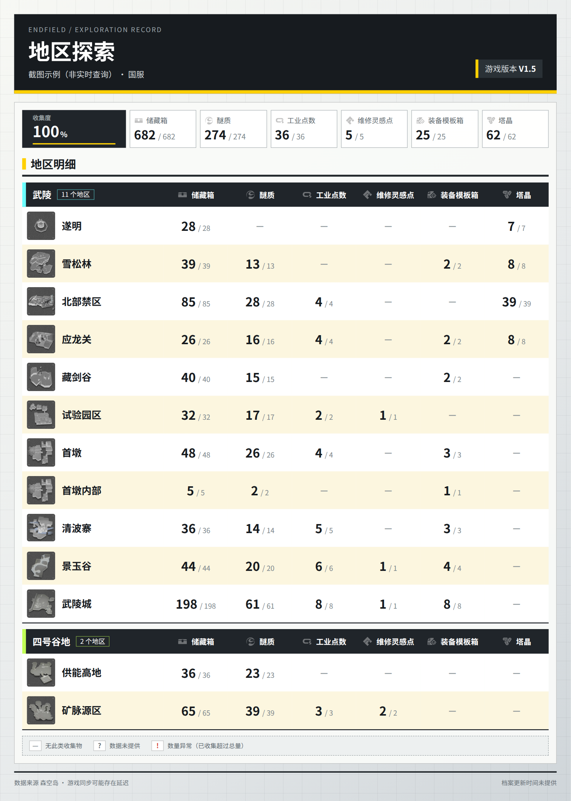

# 终末地地区探索查询

更新日期：2026-10-10（Asia/Shanghai）。

## 使用方式

先私聊 `/ef 绑定` 添加游戏账号，再发送：

```text
/zmd 探索
/zmd 探索 2
/ef 探索 昵称
/ef 地区探索 UID后四位
/ef 账号 探索 2
```

`/zmd`、`/ef`、`/endfield`、`/终末地` 共用现有入口。子命令支持 `探索`、`地区探索`、`探索统计`、`explore` 和 `exploration`。省略账号时使用当前用户的主账号；未设主账号时沿用账号存储层的首个账号回退。编号、昵称及 UID 后四位的解析也复用现有规则。

一次查询展示所选账号返回的全部大地区和小地区。“全部地区”以森空岛实际返回的数据为准，未公开、未解锁或尚未同步的内容无法补推。命令只查询发送者自己的绑定账号。群聊中 UID 脱敏，私聊中显示所选账号的完整 UID。

## 图片预览

下图使用截图中可见的 13 个地区作为本地样例，已标注“非实时查询”，不代表任何账号的当前进度。



未完成、未知总量和异常数量的展示见[边界数据预览](images/endfield-exploration/partial.png)。

## 数据与字段

复用 `EndfieldOfficialClient.card_detail()`：

```text
GET /api/v1/game/endfield/card/detail?roleId=<角色>&serverId=<区服>
data.detail.domain[]
  domainId / name
  levels[]
    levelId / name
    <收集字段>: {count, total}
  collections[]
    levelId
    <收集字段>: 已收集数
```

接口鉴权、签名刷新和服务地址选择由现有客户端处理。每次查询获取一次当前档案，不按地区逐条请求，不写死地区名或地图数量。`levels[]` 提供名称、已收集数和总量；`collections[]` 仅在对应已收集字段缺失时，按 `levelId` 补充数量，不补造总量。

六列固定按用户指定顺序排列：

| 列 | API 字段 | 显示名称 |
| --- | --- | --- |
| 1 | `trchestCount` | 储藏箱 |
| 2 | `puzzleCount` | 醚质 |
| 3 | `blackboxCount` | 工业点数 |
| 4 | `pieceCount` | 维修灵感点 |
| 5 | `equipTrchestCount` | 装备模板箱 |
| 6 | `trstarCount` | 塔晶 |

既有响应结构见 [森空岛 UI 数据清单](skland_endfield_ui_data_inventory.md#49-地区建设与探索-domain)。其中早期文档只记录了前五类字段。第六类 `trstarCount` 的结构另与公开适配器的 [EndfieldDetail 类型定义](https://github.com/wahaha216/koishi-plugin-skland/blob/b25b595abd3d7dd74b1d7e8f22fb89b78e33c81a/src/types/endfieldDetail.ts)交叉核对；该链接是第三方适配器源码，并非森空岛官方接口文档。列名及顺序按本次用户提供的森空岛截图和说明确定，没有复制该适配器的实现。

数据边界：

- 大数字为已收集数，小数字为总量。`0/N` 表示尚未收集；只有总量明确为 0，且已收集数为 0 或未提供时，显示 `—`。
- 字段缺失显示 `?`。例如只有已收集数时显示 `5/?`，不会把缺失字段当作没有这种收集物，也不会写成已完成。
- 非负整数及对应数字字符串可解析；负数、布尔值、非整数和异常结构保留为未知。
- 已收集数大于总量时保留原值并标注 `!`，不截断数值或改成 100%。
- 接口按旧地图在前、新地图在后返回大地区（`domain`），出图时整体倒序，最新的大地区排在最上面；各大地区内的小地区（`level`）沿用接口顺序。同一大地区内重复的非空 `levelId` 保留首条并提示；不同大地区允许出现相同 `levelId`。
- 接口的 `name` 常为英文（如 `Valley IV`、`The Hub`、`Test Area`）或与 ID 相同（如 `indie_dg007`）。本地素材清单已收录的小地区按 `levelId` 改用清单里的中文名（`indie_dg007` → 首墩内部、`indie_dg016` → 遂明、`map02_lv005` → 试验园区）；大地区用所属地图的中文名，`domain_1` / `domain_2` 分别对应清单的 `map01`（四号谷地）/ `map02`（武陵），其他 ID 则取其已收录小地区共同所属的地图。清单未收录的新地区保留接口原文，不写死名单。
- 只存在于 `collections[]` 的小地区仍会展示，名称缺失时用 `levelId` 标识，总量显示未知。空的大地区保留提示，不从结果中静默删除。
- 档案更新时间取 `base.saveTime`，按北京时间显示。`currentTs` 是请求时刻，不用于冒充游戏同步时间；缺失时明确标注未提供。

## 实现位置与渲染

| 文件 | 职责 |
| --- | --- |
| `plugins/endfield/account/exploration/models.py` | 六列定义、进度状态和地区视图模型 |
| `plugins/endfield/account/exploration/service.py` | 纯数据解析，处理缺失、兼容字段、重复区域和更新时间 |
| `plugins/endfield/account/exploration/draw.py` | 地区表格、状态标记、HTML 和分页图片 |
| `plugins/endfield/account/exploration/thumbnails.py` | 公开地图名称／ID 匹配、图块选择与缺图降级 |
| `plugins/endfield/account/exploration/artwork.py` | 森空岛原始图标的本地读取与内嵌 |
| `plugins/endfield/account/exploration/version.py` | 读取游戏版本标签，失败时返回未知 |
| `plugins/endfield/account/regions.py` | 大地区主题色，与基建卡片共用 |
| `assets/image/endfield/exploration/` | 立体地区图标、六类列头图标、来源清单 |
| `plugins/endfield/catalog/commands.py` | 子命令、别名及文字帮助 |
| `plugins/endfield/handlers.py` | 当前用户账号选择、取数、图片缓存及发送 |
| `scripts/help_pages.json` | 帮助卡片中的探索入口 |
| `scripts/preview_endfield_exploration.py` | 文件样例、缩略图获取及布局检查 |

视图解析只读取本地素材清单，不访问网络、不注册机器人事件。命令复用 `_card_detail_with_snapshot()` 和角色任务锁，因此同角色并发请求及接口失败沿用账号查询现有处理。该调用也沿用已有的持有率快照更新行为，没有新增探索数据库。

出图采用 End 插件账号族页面的工业 HUD 亮色风格：雾灰底、40 px 细网格和 135° 雾白渐变。页头沿用插件统一的墨底页头带（`#171b1f`，7 px 招牌黄底线），依次为 `ENDFIELD / EXPLORATION RECORD`、白字大标题“地区探索”和“昵称 · 区服 · UID”；右侧是炭底黄边的版本徽标，写“游戏版本 V1.5”（“游戏版本”为常规体，版本号为白色粗体），版本未知时写“版本未知”；分页时在其右侧再并排一枚同款页码徽标，如 `02 / 04`。地区数不再放在页头，由各组表头标注。页头以下是一块雾白内容面板。招牌黄 `#ffd000` 只用于页头底线、徽标左边、节标题竖条，以及未配地区色的组表头色条；危险红 `#d64035` 只用于“数量异常”。

渲染机与正式环境的中文字体只有常规和粗体两档，因此全卡只用两档字重：700 用于标题、节标题、地区名、已收集数、组表头的大地区名与列名、徽标中的版本号与页码、概况数值、总完成度及其上方的“收集度”标签；500 用于其余文字，包括 kicker、身份行、徽标中的“游戏版本”、概况格标签、组表头的地区数标签、总量、图例、页脚和提示文案。大标题不加负字距。

内容面板先是一行安静的收集概况，共七格，同高 80 px：左边一块墨色汇总，右边六个小统计。最左侧是收集度格，从地区列左缘起、宽 220 px；其余宽度由六个类别格均分，七格之间都是 8 px 间距，六格作为一组盖住六个数据列、右缘与最后一列对齐，每格约 141 px，不再逐列等宽，墨块旁也不留空白：整块墨底 `#20252a`，与页头、组表头同一家族，不加边框和左脊（组表头无主题色时回落为黄色色条，左格再加黄脊会被读成另一个组头），左右内边距 22 px，左 22 px 让“收集度”与下方组表头的大地区名起点对齐，内容在格内上下居中，四周留出空隙。上行是 13 px 粗体灰字 `#9aa2a5` 标签“收集度”（分页时写“本页收集度”），`?N` 徽标紧跟标签；下行是 32 px 白色粗体百分比（“%”为 16 px，同基线），未知时写灰色“--”。进度有五种画法，由 `draw.py` 的 `OVERALL_PROGRESS` 常量切换，预览脚本可用 `--progress badge|edge|arc|chip|spine` 分别出图，当前默认 `badge`。`edge`：墨块顶边一条贴边、左右不留边距的 2 px 发丝线，白色 12% 轨道上从左往右按百分比填充招牌黄 `#ffd000`，文字在线下的区域里上下居中。`arc`：墨块右侧一个 48 px 的 240° 弧形仪表，开口朝下，描边 5 px，白色 15% 轨道上按百分比沿弧填充 `#ffd000`。以下三种复用本插件已有的样式母题：`chip` 不画条，在百分比同一行右侧放一个与组表头“N 个地区”同款的小标签（22 px 高、1 px 边框、14 px 常规体），全部收齐写黄色的“已收满”，否则写“未收满”，百分比未知或有地区被排除而合计看似收满时写灰色的“数据不全”；`spine` 沿用“游戏版本”徽标的 6 px 黄色左脊，画在墨块左缘，暗色 `#3a4248` 轨道上自下而上按百分比填充 `#ffd000`；`badge`（默认）在标签和百分比下面放一条 3 px 的徽标黄细轨，作为墨块的页脚：轨道与文字栏同宽，左右各距墨块边缘 22 px，左缘与标签、百分比的左缘对齐；与百分比行之间留 10 px，标签、百分比和细轨作为一叠在墨块里上下居中；轨道为在墨底上看得清的 `#4a5258`，填充招牌黄 `#ffd000`，两端 1.5 px 小圆角，不分段，96% 时右端留出约 7 px 的暗色余量。有轨道的画法都是 100% 填满、96% 填到 96%，百分比为“--”时只留轨道，不分段。总完成度只统计每个格子都已知且无异常的地区，按其已收集数之和除以总量之和向下取整；有地区因“?”或“!”被排除时，标签右侧加 `?N` 徽标，N 为被排除的地区数，全部被排除时百分比显示 `--`。分页时与统计格一样只计本页。右侧六个统计格作为一组铺满墨块之后的宽度。六个统计格不加墨脊，只留 1 px 灰框 `#abb2b5`，内边距上 11、右 6、下 11、左 8 px，内容在格内上下居中；每格只有两行，上行是图标加类别名，下行是数值，格子下方不放灰色说明文字。六格各带单色化的收集物图标，给出该列已知部分的已收集／总量合计：只累加数量和总量都已知、且数量不超过总量的格子，“?”和“!”格子不计入，“—”格子不参与。是否收齐直接由合计数字看出，不再另写“还差 N”或“已收满”。有格子被排除时仍显示已知部分合计，并紧跟“/ 总量”放一个小方框徽标 `?N`（间距 5 px），N 为未计入的地区数；计数、总量与 N 的位数合计达到 7 位时该格改用紧凑字号（计数 22 px、总量 14 px、徽标 12 px，间距 3 px），达到 9 位且带徽标时徽标另起第三行右对齐，该格上下内边距收为 3 px、数值行收为 28 px，格高不变；一个格子都无法累加时数值显示 `--` 加同样的徽标；整列都没有此类收集物时显示“—”。分页时统计格只计本页。

随后是“地区明细”。大地区按最新在上排列，各组内的小地区按接口顺序，连成一张表，不加序号。表头与大地区分组合并为组表头：每个大地区（分页时为每页里的每一段）以一条通栏墨色组表头开头，不再另设顶部表头。组表头 52 px 高，`#20252a` 墨底，左侧 8 px 通高色条使用该大地区的主题色：四号谷地 `#c1ff55`、武陵 `#6bffff`，与基建卡片的地区标记同色，统一定义在 `plugins/endfield/account/regions.py`，先按 domainId、再按名称匹配，未知地区回退为招牌黄 `#ffd000`；地区数小标签的细边框也按 60% 浓度染成同色；地区列上方是 20 px 白色粗体的大地区名，再跟一个细边框小标签写地区数（14 px 常规体，如“11 个地区”，分页时为“本页 N 个地区”）；六个数据列上方各是 22 px 反白收集物图标加 16 px 白色粗体列名，居中压在本列正上方。组表头是一个横跨七列的单元格，内部按“300 px + 六等分”栅格排布，与概况格同一套对齐，墨底连续无缝。行内不再重复大地区；空的大地区为组表头加一条“暂无地区明细”提示。组表头不计入每页 24 行的预算，超高时由既有的分页降级兜底。数据行不画格线和竖向分隔，读作干净的横行：组内奇偶行交替白底与极浅暖黄底（`#fcf6df`），每个组表头之下重新从白底开始计数。每组以一条 2 px 墨线收尾，组与组之间留 12 px 空隙。表格和概况格的数字统一写成 `28 / 28`：已收集数为墨色粗体，`/ 总量` 为较小的灰色常规体，两者基线对齐、间隔 5 px；数量或总量缺失时用灰色粗体 `?` 代替，如 `? / 5`、`1 / ?`；数量异常显示红色数字与上标 `!`，如 `9! / 8`。没有此类收集物的格子不铺底色，只在格中写一个 18 px 粗体的中灰“—”（`#858e93`），清楚可见但明显浅于真实数字。表格下方的虚线说明条是全卡唯一的注释处，用白底小方框解释“—”“?”“!”三种标记，“—”样例同色；当概况格或总完成度出现 `?N` 徽标时，说明条再追加一项“概况合计未计入 N 个数据不全的地区”。页脚左侧为“数据来源 森空岛 · 游戏同步可能存在延迟”，右侧为档案更新时间；版本只在页头徽标显示，页脚不再重复。

图片宽度按列收紧，不再摊在固定宽画布上：地区列宽 300 px（概况行的收集度格从它左缘起、宽 220 px，六个类别格各约 141 px），六个数据列各 136 px（表格里的“198 / 198”和组表头里带图标的“维修灵感点”列名都只占约 90～110 px），卡片逻辑宽度由列宽加内外边距反推为 1210 px。类别格左右内边距为 8 / 6 px，内容宽约 125 px，类别图标 20 px；长合计按上述位数规则缩小字号或把徽标移到第三行，不撑宽列也不越出格子；概况格高 80 px（类别行 21 px、数值行 32 px），组表头 52 px。森空岛立体地区图标为 60 × 60 px，保持原图裸放；AKEData 图块回退放在同尺寸炭底槽中，缺图时显示同尺寸虚线空框。基础行高为 80 px，长名称换行时两行均分并自动增高。字号：大标题 46 px，节标题 24 px，地区名称 21 px，已收集数 26 px，概况数值 26 px，总完成度 32 px（“收集度”标签 13 px），总量 15 px（概况内 16 px），组表头大地区名 20 px、列名 16 px、地区数标签 14 px，概况标签 15 px，`?N` 徽标、图例和页脚 13 px；文字行高不低于 1.2，数字使用等宽数字。复用 `_draw_gallery_catalog()`、共享 Playwright 浏览器和 PNG 优化器，按 1.25 倍生成，实际宽度为 1513 px。图片经无损 PNG 重打包后以本地文件原图交给 LLOneBot 发送，变窄后每个 CSS 像素的采样密度不变，在手机上按屏宽缩放时字形反而更大、更清楚，因此不调整倍率。

页头徽标显示游戏版本，如“游戏版本 V1.5”。版本来自项目既有的 [AKEData manifest](https://data.akedata.wiki/manifest.json)，通过 `game_version_label()` 提取主、次版本号；该标签表示数据站收录的当前游戏版本，不表示账号档案已同步到该版本。manifest 地址每分钟换一次缓存参数，查询常常是冷请求，因此版本查询与读取账号档案并行，外层上限比 manifest 请求自身的 30 秒 HTTP 超时多留 10 秒，不再在 5 秒时提前放弃（此前冷启动或网络稍慢就会误报“版本未知”）。失败、超时或返回无效标签时徽标显示“版本未知”，收集统计仍可出图。

每页最多 24 行地区明细，空的大地区占一行提示。超过时继续分页，保留全部行，每页每个大地区段都以组表头开头并标注页码；若浏览器报告超高，则按 12、6、1 行依次缩小分页。其他渲染错误正常上抛，不伪装成成功或返回截断图片。大地区归属仍保存在内部模型中，用于图标匹配和去重。

每次命令先确认账号并读取当前数据，再使用 `_render_account_pages()` 缓存图片。缓存键包含账号、区服、群聊／私聊状态和视图内容摘要；数量或版本标签变化后重新绘图，群聊不会复用包含完整 UID 的私聊图片。用户和接口返回的文本均经过 HTML 转义。

## 地区缩略图

每个小地区名称前优先展示森空岛同款立体图标。资源来自官方新版[地区探索组件](https://assets.skland.com/_static_assets/game-tools/RegionExploreTable-D36RE3Dz.js)：多数 PNG 以内嵌 Base64 保存，雪松林和遂明使用独立图片地址。组件共映射 17 个区域，首墩与首墩内部共用一张图。六类列头图标也从同一组件提取，并按其表头与统计字段逐列核对。

原始图片已存入 `assets/image/endfield/exploration/`。`manifest.json` 记录来源、地区映射和 SHA-256；地区名称及所属关系由[森空岛公开地图树](https://zonai.skland.com/web/v1/game/endfield/map/tree)补充。已收录区域无需联网下载素材，渲染时直接内嵌本地 PNG。具体来源和维护方式见[素材说明](../assets/image/endfield/exploration/README.md)。

匹配先确认大地区，再查找其下的小地区。大地区依次按精确 ID、`domain_1` → `map01` / `domain_2` → `map02` 别名、完整名称查找；小地区优先使用精确 ID，找不到 ID 时按完整名称匹配；重名或跨地区的候选不猜测。本地立体图标另外允许只凭 `levelId` 命中：素材清单中只出现一次的 `levelId` 即使大地区对不上也能取图，结果仍按接口返回的大地区 ID 和 `levelId` 归位。素材请求只访问公开地图树、索引及图片地址，不携带账号凭据、UID 或收集统计。

未收录的新区域尝试平面地图回退，图块由 [AKEData 素材索引](https://data.akedata.wiki/asset-sync-index.json)提供。选取 `levelmapchunks` 下的低分辨率 `l_` 资源，优先使用 `sprites`，缺少完整矩形网格时尝试 `textures`。两类资源独立校验，不混合拼接；每个区域最多使用 64 块。图块按横向坐标和自下而上的纵向坐标排列，整张网格等比缩放到名称前的方框中。回退只处理缺少立体图标的区域，保留已有官方图标。

公开地图树和素材索引的缓存有效期设为 1 小时；图片复用共享素材缓存、下载预算和浏览器资源注入。索引缺失、地区未匹配或下载缺图时显示占位，名称和六列统计仍正常展示。元数据请求失败或图片下载不全时，渲染健康检查会阻止该图片进入完整结果缓存，使下次查询能够重试。

## 单元测试与样例预览

在项目根目录运行：

```powershell
$env:PYTHONUTF8 = '1'
.\.venv\Scripts\python.exe -m pytest -q tests/test_endfield_exploration.py tests/test_endfield_daily.py tests/test_endfield_account.py tests/test_endfield_account_ui.py tests/test_architecture.py tests/test_group_features.py tests/test_help_cards.py tests/test_help_plugin.py
.\.venv\Scripts\python.exe scripts/preview_endfield_exploration.py --stress
# 收集度格的其它进度画法：edge、arc、chip、spine
.\.venv\Scripts\python.exe scripts/preview_endfield_exploration.py --stress --progress chip --output data/endfield/exploration/previews-chip
```

新增测试覆盖命令别名、主账号和指定账号、群聊脱敏、完整命令分发、单次档案请求、接口错误、未绑定与无效账号、六列对应关系、新地区、缺失／零值／异常计数、旧字段按 ID 合并、重复区域、大地区倒序与组内原序、北京时间、HTML 转义、分页完整性和图片缓存隔离。另用 `domain_1` / `domain_2`、英文或裸 ID 名称和真实 `levelId` 模拟线上响应，验证中文名、主题色和离线立体图标。版本测试另覆盖标签提取、查询失败、冷请求不早于 HTTP 超时被截断，以及版本变化后重新出图。

缩略图测试另覆盖大地区和小地区的精确匹配、`domain_N` 别名、重名歧义、图块坐标、两类素材选择、不完整网格、路径限制、名称前的图片布局，以及元数据异常、缺图和渲染健康状态。官方图标的测试验证原始文件哈希、六列表头、13 个参考区域的离线匹配、仅凭 `levelId` 命中，以及新增区域回退时保留已有立体图标。

预览默认读取 `tests/fixtures/endfield/exploration/screenshot.json`，其中只有用户截图可见的 13 个区域。大地区按接口的旧→新顺序录入，出图后武陵在上；地区／区域 ID 使用测试占位；它不是实时账号响应，也不代表游戏全部区域。预览图片显式标注“截图示例（非实时查询）”。

生成文件位于 `data/endfield/exploration/previews/`：

- `exploration.png`：截图中 13 个地区的列表，按大地区分组。
- `partial.png`：未完成、缺失、无此类收集物及异常数量。
- `mixed.png`：在截图样例上散布未收齐与缺失总量，检查概况格的已知部分合计和地区计数。
- `pagination-1.png` 至 `pagination-4.png`：73 个区域的分页压力样例。
- `empty.png`：空数据提示。
- 同名 HTML 与 `validation.json`：便于检查布局、行数和外部请求。

也可传入自行保存的脱敏详情文件：

```powershell
.\.venv\Scripts\python.exe scripts/preview_endfield_exploration.py --file data/endfield/exploration/research/detail-redacted.json
```

预览脚本不读取绑定凭据，不启动机器人，不发送消息；文件预览会覆盖昵称并省略 UID。统计值来自本地文件，版本标签通过公开 manifest 查询。已收录的立体图标和六类列头图标直接读取本地素材；未知地区才联网尝试平面地图回退。脚本使用正式解析和绘图函数，另用浏览器检查文字溢出、画布高度、破图及外部请求。导出的 HTML 内嵌全部已加载图片，打开时无需额外访问图片源。

帮助图片更新方式：

```powershell
.\.venv\Scripts\python.exe scripts/render_help_cards.py --page endfield --output-dir data/endfield/exploration/previews/help --write
```

## 本次验证与待验收项

2026-10-07，Windows / Python 3.13：截图样例的 13 个地区均成功匹配并加载官方立体图标，六类收集物图标在收集概况中展示一次，版本标签为 `V1.5`。逻辑尺寸为 1210 × 1696.56 px，PNG 尺寸为 1513 × 2120 px（样式定稿后在 Linux / Python 3.12 预览环境重新采样）。分页压力样例保留 73 行，分为 24、24、24、1 行。新增的 `mixed` 样例在截图数据上散布 4 处未收齐和 1 处缺失总量。8 张探索样例均无文字溢出、无破图，导出 HTML 打开时没有外部请求。布局记录保存在 `data/endfield/exploration/previews/validation.json`。

探索测试共 38 项，其中 15 项覆盖图标。上述相关回归结果为 **314 passed、116 subtests passed**，有一条第三方 `creart` 事件循环弃用警告；完整输出保存在 `data/endfield/exploration/validation/tests.txt`。探索模块、测试和预览脚本的 Ruff 检查、格式检查，以及 `git diff --check` 均通过。终末地帮助卡片已重新生成，尺寸为 1325 × 1147 px，通过布局与产物一致性检查。

提交前另执行了全量测试，结果为 **1983 passed、21 failed、2 skipped、460 subtests passed**。在同一 Python 环境、未修改的上游 `f6d1716` 独立工作区中，21 项失败全部复现：1 项 B 站文档图片像素比对、1 项 Grok 响应字节数断言、3 项 HTTP 代理测试，以及 16 项 Windows SQLite 临时文件清理测试。该环境的 httpx 版本为 0.24.0，代理测试涉及较新版本的参数和内部结构。此 PR 不修改这些模块；完整结果和基线复现分别保存在本地 `full-tests.txt`、`baseline-failures.txt`，与上述回归报告同目录。

本机绑定表为空，因此本次未验证实际账号的最新接口响应或 QQ 投递。部署后需要用已绑定账号执行 `/zmd 探索`，核对全部地区名称、六类计数与森空岛当前页面是否一致，并确认群聊、私聊和指定账号的图片发送。亚服沿用现有客户端路径，但本次没有亚服真实响应样本，不能将离线测试视为该区服的线上验收。
