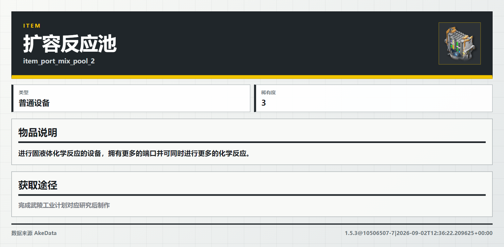

# 随机 Wiki 资料

发送 `/zmd 随机`，机器人会随机返回一条终末地公开资料卡，无需绑定账号。
可使用 `/ef 随机`、`/终末地 随机`、`/endfield 随机`；子命令也支持
`随机wiki`、`随机百科`、`random`、`rand`，英文不区分大小写。
例如 `/ef random` 与 `/zmd 随机` 等价。

命令不接受附加参数。`/zmd 随机 账号` 或 `/zmd 随机 -s fz` 会返回用法提示。

## 内容范围

| 类别 | 随机内容 |
| --- | --- |
| 干员（角色） | 单个干员的公开资料 |
| 武器 | 单件武器的公开资料 |
| 装备 | 单件装备，包含所有稀有度 |
| 敌人 | 图鉴中公开列出的敌人 |
| 关卡（副本） | 已支持查询的静态关卡资料，沿用默认变体选择 |
| 物品 | 材料等物品的说明与获取途径 |
| 道具 | 食物、药剂等道具的效果 |
| 词条 | 术语、机制说明与关联资料 |
| 公开档案条目 | 已收录到本地公开档案快照的条目 |

账号概览、资源流水、养成统计、抽卡记录、日常、基建、挑战记录、收藏进度
及持有率统计均不在候选范围内。随机选择不读取用户身份、账号绑定或个人接口。
公开档案快照尚未建立时会跳过该类别，不要求用户绑定账号或刷新个人数据。

## 选择与失败处理

每次调用重新打乱类别顺序，从首个可用类别中等概率选择一个条目。
同一类别内按条目 ID 去重，隐藏条目、空名称和空 ID 不参与抽取。
这种方式让干员、装备、材料等类别都有机会出现，不按各类条目数量加权。
连续调用可能抽到同一条内容。

候选目录来自 AKEData 和已有公开档案快照，卡片复用普通查询的渲染与缓存。
干员、武器和装备保留现有的公开 FZ Wiki 回退；随机选择本身不缓存。
公开档案的缓存键包含快照版本和刷新时间，同版本资料修订后也会重新出图。
成功后只发送所选条目的卡片，同一条目如有多页会一起发送。

目录为空或请求失败时尝试下一类别。每次最多尝试渲染三个条目；
选取过程从开始计时，30 秒后不再加载下一类别，每次目录请求最多等待 15 秒。
卡片渲染和发送仍沿用原有机制，因此 30 秒不是整条命令的总耗时上限。
没有可用卡片时回复“公开 Wiki 资料暂时不可用，请稍后再试。”
发送失败后停止抽取，避免换一条内容再次发送；任务取消会正常向上传递。

## 维护与验证

选择服务位于 `plugins/endfield/catalog/random_wiki.py`，命令解析位于
`catalog/commands.py`，`handlers.py` 负责出图和发送。
`PUBLIC_WIKI_KINDS` 是明确的公开类别白名单，新增命令或渲染器不会自动扩大随机范围。
服务选取和发送前均检查类别，扩展范围时应一并验证数据来源与渲染内容。

新增回归使用保存的 AKEData 夹具和模拟消息发送，覆盖七类 AKE 目录、公开关卡与档案、
命令别名、个人数据排除、去重、空目录、超时、取消、档案刷新、渲染失败及发送失败。
真实 Entari 加载测试验证四个根命令入口，以及群功能关闭后不再执行随机查询；
该群的关闭操作不会影响其他群或私聊。
在项目根目录运行：

```powershell
.\.venv\Scripts\python.exe -m pytest tests/test_endfield_random_wiki.py -q
```

2026-10-07 在上游 `9497992` 基线上验证：新增测试 26 项、子测试 37 项通过；
连同终末地查询、图鉴、查询优化、查询提示、关卡、档案、AKE 迁移、冷启动、
架构、群功能、帮助卡及更新日志测试，共 551 项、子测试 243 项通过。
测试中有一条第三方 `creart` 事件循环弃用警告，未向真实 QQ 会话发送消息。
详细报告保存在本地 `data/endfield/random-wiki/validation/pr-2026-10-07/`。

帮助文字、页面配置和静态帮助图已同步。帮助图预览与布局检查结果位于本地
`data/endfield/random-wiki/previews/help/`，不进入版本管理。

## 本地运行预览

以下脚本走实际命令处理、随机选择、公开数据获取及出图流程，用本地接收器保存
机器人回复的 PNG 与 `result.json`，不启动 QQ 连接，也不提供用户身份或账号凭据：

```powershell
.\.venv\Scripts\python.exe scripts/preview_endfield_random_wiki.py
```

默认输出到 `data/endfield/random-wiki/previews/<时间戳>/`。
可用 `--output-dir` 指定目录，或用 `--seed` 固定选择过程；公开数据更新仍会影响结果。
2026-10-07 的一次实际运行抽中了 AKEData 物品“扩容反应池”，生成一张资料卡，
保存在 `data/endfield/random-wiki/previews/run-2026-10-07/reply-01.png`。
下图为该次运行的原始输出，复用 bot 现有资料卡样式：


