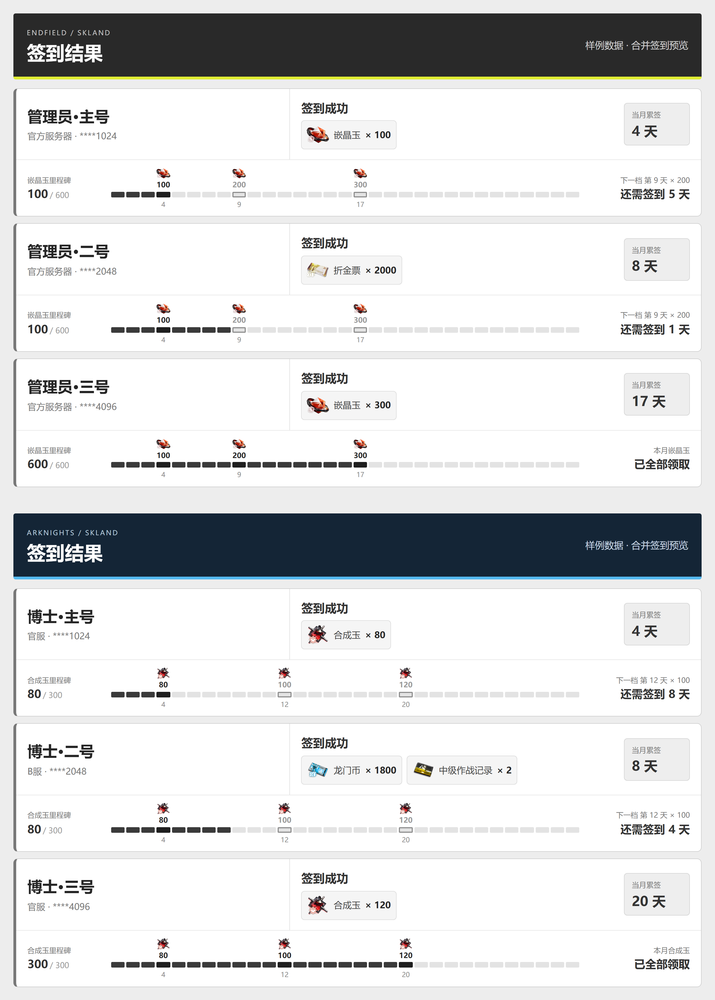

# 统一签到入口 `/签到`

`plugins/signin/` 只做调度：它没有自己的数据库、凭据或客户端，而是依次调用两个游戏
插件已经实现的签到服务，将各自渲染的卡片上下拼成一张图片后发送。终末地与明日方舟继续使用各自的
`data/` 数据库、各自的凭据密钥和各自的 HTTP 客户端。

## 命令

| 命令 | 说明 |
| --- | --- |
| `/签到` | 依次签到终末地与明日方舟的**全部已绑定角色**，合成一张结果图发送 |
| `/签到 <其他内容>` | 第一版不接受参数，返回用法提示 |
| `/ef 签到 [全部\|编号\|昵称\|UID后四位]` | 保留；只签到终末地 |
| `/ak 签到 [全部\|编号\|昵称\|UID后四位]` | 保留；只签到明日方舟 |

别名：`/checkin`、`/qiandao`。

## 行为

| 用户绑定情况 | `/签到` 的行为 |
| --- | --- |
| 同时绑定两个游戏 | 两个游戏的全部已绑定角色都签到，上方终末地、下方明日方舟，合成一张图片 |
| 只绑定一个游戏 | 只执行该游戏并返回它的结果；未绑定的游戏不提示、不查询接口 |
| 两个都未绑定 | 提示“请私聊使用 /zmd 绑定（终末地）、/ak 绑定（明日方舟）” |
| 某个角色失败或登录过期 | 该角色在自己的卡片里显示失败原因，其余角色与另一个游戏继续 |
| 今天已经签到 | 正常显示“今日已签到” |
| 本群关闭了某个游戏 | 不查询该游戏的签到接口，提示“本群未开启该功能，已跳过” |
| 某个游戏插件未加载 | 提示“签到功能暂不可用（插件未加载）”，**不会**误报为未绑定 |

执行顺序固定为：终末地 → 明日方舟，与插件注册先后无关。每个游戏独立捕获异常：数据库异常、密钥
缺失、接口错误都不会阻断另一个游戏。绑定记录先查、凭据后解密，未绑定的用户不会收到
密钥错误。

## 结构与复用

- `otae_bot/attendance_registry.py`：共享注册表与调度循环，只依赖 `otae_bot.*`，
  不导入任何 `plugins.*`（`tests/test_architecture.py` 会校验这一点）。
- 两个游戏插件在**加载时**各自注册一份能力（游戏标识、查询绑定角色、执行签到、
  生成图片和文字结果）。统一入口不导入它们的 `handlers`，避免重复注册命令和初始化副作用。
- 注册按游戏标识覆盖，热重载不会残留旧实例；插件被真正卸载时，
  `otae_bot.application` 监听 `PluginUnloaded` 清理对应注册；回调参数显式标注事件类型，
  使 Entari 注入卸载事件，避免误收应用实例而漏清理。
- 防重锁沿用原实现：明日方舟使用 `plugins.arknights.tasks.ROLE_TASKS`，
  终末地使用 `plugins.endfield.gacha.service.ROLE_TASKS`。因此 `/签到` 与
  `/ak 签到`/`/ef 签到` 同时执行时，同一角色只会提交一次签到请求。
- 卡片样式与单游戏入口完全一致：终末地采用新版圆角布局、黄绿底线和累签里程碑；
  明日方舟保留蓝黑头部与亮蓝底线，奖励使用已审核的本地图标。
- `plugins/signin/presentation.py` 在共享图片线程池中拼接两张 PNG，按较窄图片等比缩放，
  不放大、不裁掉账号行。拼接结果超过 16384px 高或 3200 万像素时回退完整文字。
- 正常只发送一次：一张图片和必要的失败/跳过说明放在同一条消息里。
  某个游戏渲染失败时，其完整文字结果随另一张卡发送；拼接失败时两款游戏一起回退文字。
  图片发送失败会尝试发送一次完整文字结果，**不会**重新执行签到请求。

## 帮助

`/help 签到`、`/ak 帮助`、`/ef 帮助` 都注明 `/签到` 会执行全部已绑定角色。

## 测试

`tests/test_signin_registry.py` 使用临时数据库与模拟接口覆盖：双游戏绑定、单游戏绑定、
完全未绑定、群内关闭其中一个游戏、插件未加载、一个游戏异常另一个仍完成签到、
同一角色不重复提交、渲染失败回退文字、用户之间绑定隔离、热重载与卸载后的注册清理。
`tests/test_signin_presentation.py` 检查拼接顺序、缩放、图片预算与文字回退，
`tests/test_architecture.py` 通过真实 Entari 事件验证插件卸载、重新加载与能力注册。

运行 `scripts/render_signin_preview.py` 可生成使用实际渲染器和拼接函数的预览，
覆盖双游戏成功、各 3 个账号、单游戏失败、单角色失败与均未绑定；数据为样例，
不读取真实凭据、不调用游戏接口，仅通过正式图片加载链路获取终末地的公共奖励图标。
加上 `--case six-accounts` 可单独生成终末地 3 个角色与明日方舟 3 个角色的合成图。

六账号效果（样例数据，奖励数量只用于展示布局）：

