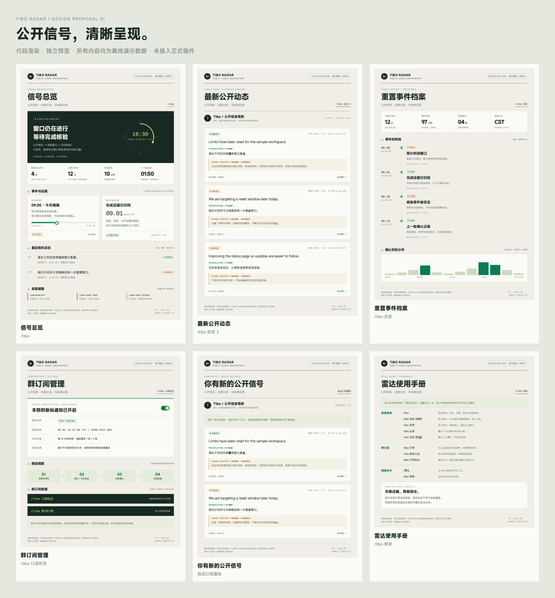

# Tibo Radar · 信号情报面板 / 独立 UI 提案

此目录只在 `design/tibo-radar-ui-preview` 分支提供，**不接入正式插件**。
主分支 `5d66bad` 已包含推送可靠性及多账号绑定修复，仍使用原渲染器。

19 张样板图全部由本目录的 **Python + HTML/CSS/SVG + Playwright** 生成，
没有使用生图工具。米白底、墨黑信息标题、信号绿与状态语义色构成统一视觉。
所有数据与发言均为明确标注的离线虚构样例，不代表真实 Tibo 动态、实时状态、
实际群订阅或下一次重置预测。样例原帖只使用 `example.com`。



## 直接看图

| 页面 | 样板 |
| --- | --- |
| 总览 | [信号总览](samples/01-overview.png) |
| 动态 | [原文 / 翻译 / 解读](samples/02-feed.png) |
| 当前状态 | [预计窗口](samples/03-status.png) |
| 最近确认 | [核验事件](samples/04-recent.png) |
| 历史 | [时间线与统计](samples/05-history.png) |
| 订阅状态 | [群订阅管理](samples/06-subscription.png) |
| 自动推送 | [新帖通知](samples/07-notification.png) |
| 帮助 | [命令手册](samples/08-help.png) |
| 空数据 | [暂无记录](samples/09-empty.png) |
| 故障 | [来源异常与发送重试](samples/10-error.png) |
| 操作反馈 | [订阅成功](samples/11-subscribed.png) · [已取消](samples/12-unsubscribed.png) |
| 输入与权限 | [权限不足](samples/13-permission.png) · [参数错误](samples/14-invalid.png) |
| 其余状态变体 | [官方预告](samples/15-state-official_announcement.png) · [疑似](samples/16-state-suspected.png) · [已确认](samples/17-state-confirmed.png) · [无确认信号](samples/18-state-unconfirmed.png) · [已否定](samples/19-state-rejected.png) |

## 本机运行

不要在运行正式机器人的目录切换预览分支。建议另开目录克隆：

```bash
git clone --branch design/tibo-radar-ui-preview --single-branch https://github.com/otae-1204/otae-bot-entari.git otae-tibo-preview
cd otae-tibo-preview
python -m venv .venv
```

Windows PowerShell：

```powershell
.\.venv\Scripts\python.exe -m pip install playwright
.\.venv\Scripts\python.exe -m playwright install chromium
.\.venv\Scripts\python.exe previews/tibo-radar/render.py
.\.venv\Scripts\python.exe -m http.server 8765 --bind 127.0.0.1 --directory output/tibo-radar-preview
```

Linux / macOS：

```bash
.venv/bin/python -m pip install playwright
.venv/bin/python -m playwright install chromium
.venv/bin/python previews/tibo-radar/render.py
.venv/bin/python -m http.server 8765 --bind 127.0.0.1 --directory output/tibo-radar-preview
```

浏览器打开 <http://127.0.0.1:8765/>。点击缩略图查看完整 HTML 页面。
若 Linux 缺 Chromium 系统库，可执行 `python -m playwright install-deps chromium`。
已有项目虚拟环境时可直接使用，不需要重装机器人全部依赖。

仅生成 HTML（无需 Playwright）：`python previews/tibo-radar/render.py --html-only`。
首次仅 HTML 模式没有 PNG 缩略图，但各页面 HTML 仍可从标题链接打开。
`--output` 可指定输出目录；`--publish-samples` 将生成的 PNG 和验证报告复制到
本目录 `samples/`（更新设计稿时使用，会覆盖同名旧样板）。

## 安全边界与验证

- 渲染程序不导入 `plugins` / `otae_bot`，不读取 `.env` / 数据库，不注册事件，
  不连接 QQ、不调用私人或公开数据接口；浏览器截图期间禁止 HTTP(S) 请求。
- 复用仓库已有 MiSans 字体；雷达刻度与图表均为代码绘制，字体会复制到输出目录。
- 正式页面没有改用这些模板，图中的开关与命令只是视觉样板，不执行操作。
- 页面宽 1080 像素，高度随内容增长。本轮 19 页均成功截图、字体加载正常，
  无页面或内部元素横向溢出；6 项预览单元测试通过。
  验证报告见 [validation.json](samples/validation.json)。
- 单元测试：`python -m unittest discover -s previews/tibo-radar -p 'test_*.py'`。
- `render.py` 生成页面及画廊；`styles.css` 定义视觉；样例数据在 `render.py` 的
  `POSTS` / `STATUS` 常量。不要把该目录的提案文案当成线上真实数据。
